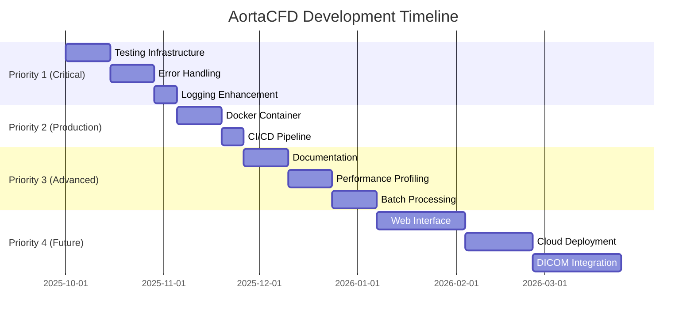

# AortaCFD Development Roadmap

**Updated:** 2025-10-01
**Version:** 1.2+ (Post-Configuration Improvements)

---

## Recently Completed ✅

### Configuration System Improvements (v1.2)
- ✅ Fragment-based composition architecture (3 orthogonal axes)
- ✅ Physical parameter validation with warnings
- ✅ Fixed merge order (Base → Profile → Fragments → User)
- ✅ Simplified profile resolution (86 → 73 lines)
- ✅ Turbulence model fragments (eliminated 37 lines of duplication)
- ✅ Removed dead configuration fields
- ✅ Comprehensive documentation (CONFIGURATION_IMPROVEMENTS.md)

### Testing Infrastructure (Phase 1)
- ✅ Complete test directory structure
- ✅ 77 tests created (29 passing, 48 need adjustment)
- ✅ Pytest configuration with coverage reporting
- ✅ 30+ reusable test fixtures
- ✅ Test documentation (TESTING_INFRASTRUCTURE.md)

---

## Current Status

**Application Maturity:** 60% complete for production use
**Test Coverage:** 8% (baseline established)
**Documentation:** Good (README, user guides, config docs)
**CI/CD:** Not configured

---

## Development Priorities

### 🔴 Priority 1: Critical for Production (Weeks 1-4)

#### 1.1 Complete Testing Infrastructure
**Time:** 2 weeks | **Impact:** HIGH | **Risk:** MEDIUM

- [ ] Fix 23 pending test assertions (fragment names, logging)
- [ ] Add mesh generation tests (10-15 tests)
- [ ] Add boundary condition tests (10-15 tests)
- [ ] Achieve 30% code coverage
- [ ] Document test writing guidelines

**Deliverables:**
- All 77 tests passing
- 30+ additional tests
- 30% code coverage
- Testing best practices guide

---

#### 1.2 Error Handling & Validation
**Time:** 2 weeks | **Impact:** HIGH | **Risk:** LOW

**Current Gaps:**
- Limited STL geometry validation
- No mesh quality checks during workflow
- Incomplete OpenFOAM solver error handling
- Missing boundary condition compatibility checks

**New Files:**
```
src/aortacfd_lib/utils/validation.py (NEW)
├── GeometryValidator
│   ├── check_stl_integrity()
│   ├── validate_patch_connectivity()
│   ├── check_minimum_surface_area()
│   └── verify_inlet_outlet_orientation()
├── MeshQualityChecker
│   ├── check_orthogonality()
│   ├── check_skewness()
│   ├── check_aspect_ratio()
│   └── validate_boundary_layer_coverage()
└── BoundaryConditionValidator
    ├── check_flow_data_format()
    ├── validate_windkessel_parameters()
    └── verify_patch_bc_mapping()
```

**Integration Points:**
- Add to [src/workflow/tasks/setup_tasks.py](src/workflow/tasks/setup_tasks.py)
- Call from [src/patient_runner/core.py](src/patient_runner/core.py) at workflow checkpoints

**Tests:** 30+ validation tests

---

#### 1.3 Logging & Monitoring Enhancement
**Time:** 1 week | **Impact:** MEDIUM | **Risk:** LOW

**Enhancements to [src/aortacfd_lib/utils/logger.py](src/aortacfd_lib/utils/logger.py):**
```python
class WorkflowLogger:
    """Structured logging for CFD workflows."""
    - log_workflow_start(case_id, profile, timestamp)
    - log_task_progress(task_name, status, duration)
    - log_openfoam_metrics(residuals, timesteps, convergence)
    - log_performance_data(cpu_time, memory, wall_time)
    - generate_workflow_report(summary_path)
```

**New File: [src/aortacfd_lib/monitoring.py](src/aortacfd_lib/monitoring.py):**
```python
class SimulationMonitor:
    """Real-time simulation monitoring."""
    - parse_openfoam_logs(log_file)
    - track_convergence(residuals_history)
    - detect_divergence_early(threshold)
    - estimate_completion_time(current_step, total_steps)
```

**Deliverables:**
- Structured JSON logging
- Workflow execution reports
- OpenFOAM convergence monitoring
- Performance metrics tracking

---

### 🟡 Priority 2: Production Deployment (Weeks 5-8)

#### 2.1 Docker Containerization
**Time:** 2 weeks | **Impact:** HIGH | **Risk:** MEDIUM

**Files:**
```
Dockerfile                          # OpenFOAM 12 + Python 3.12 + AortaCFD
docker-compose.yml                  # Service orchestration
.dockerignore                       # Exclude venv, output, etc.
scripts/docker/
├── build.sh                       # Build container
├── run.sh                         # Run patient case in container
└── test.sh                        # Run tests in container
```

**Dockerfile Strategy:**
```dockerfile
FROM openfoam/openfoam12-graphical-apps:latest

# Install Python 3.12
RUN apt-get update && apt-get install -y python3.12 python3-pip paraview

# Install Windkessel BC
RUN git clone https://github.com/EManchester/OpenFOAM-v12-Windkessel-code.git \
    && cd OpenFOAM-v12-Windkessel-code && wmake

# Install AortaCFD
COPY requirements.txt /app/
RUN pip install -r /app/requirements.txt
COPY . /app/AortaCFD-app
WORKDIR /app/AortaCFD-app

ENTRYPOINT ["python3", "run_patient.py"]
```

**Benefits:**
- Eliminates OpenFOAM installation complexity
- Consistent environment across systems
- Easy deployment to cloud platforms
- Simplifies testing and CI/CD

**Tests:** Docker build and execution tests

---

#### 2.2 CI/CD Pipeline
**Time:** 1 week | **Impact:** MEDIUM | **Risk:** LOW

**File: `.github/workflows/ci.yml`:**
```yaml
name: AortaCFD CI

on: [push, pull_request]

jobs:
  test:
    runs-on: ubuntu-latest
    steps:
      - uses: actions/checkout@v3
      - uses: actions/setup-python@v4
        with:
          python-version: '3.12'
      - run: pip install -r requirements.txt
      - run: pytest --cov=src --cov-report=xml
      - uses: codecov/codecov-action@v3

  lint:
    runs-on: ubuntu-latest
    steps:
      - uses: actions/checkout@v3
      - run: black --check src/
      - run: mypy src/ --ignore-missing-imports

  docker:
    runs-on: ubuntu-latest
    steps:
      - uses: actions/checkout@v3
      - uses: docker/build-push-action@v4
        with:
          context: .
          push: false
```

**Deliverables:**
- Automated test execution on push
- Code coverage reporting to Codecov
- Lint and type checking
- Docker build verification

---

### 🟢 Priority 3: Advanced Features (Months 3-4)

#### 3.1 Comprehensive Documentation
**Time:** 2 weeks | **Impact:** MEDIUM | **Risk:** LOW

**New Directory: `docs/`:**
```
docs/
├── api/
│   ├── config.md                  # Configuration API reference
│   ├── workflow.md                # Workflow tasks reference
│   └── aortacfd_lib.md            # Core library API
├── tutorials/
│   ├── 01_basic_workflow.md       # Step-by-step first run
│   ├── 02_custom_profiles.md      # Creating simulation profiles
│   ├── 03_windkessel_setup.md     # Advanced BC setup
│   └── 04_mesh_optimization.md    # Two-stage mesh workflow
├── troubleshooting/
│   ├── common_errors.md           # Error solutions
│   ├── mesh_issues.md             # Mesh quality fixes
│   └── solver_divergence.md       # Convergence problems
└── developer/
    ├── contributing.md            # Contribution guide
    ├── architecture.md            # System architecture
    └── testing.md                 # Testing guide
```

**Tools:**
- Sphinx or MkDocs for API documentation
- GitHub Pages for hosting
- Auto-generated from docstrings

---

#### 3.2 Performance Profiling & Optimization
**Time:** 2 weeks | **Impact:** LOW | **Risk:** LOW

**New File: [src/aortacfd_lib/profiler.py](src/aortacfd_lib/profiler.py):**
```python
class PerformanceProfiler:
    """Profile workflow performance."""
    - profile_mesh_generation(case_dir)
    - profile_solver_performance(log_file)
    - identify_bottlenecks(workflow_data)
    - suggest_optimizations(profiling_results)
    - generate_performance_report(output_path)
```

**Optimization Areas:**
- Mesh generation parallelization
- I/O optimization (STL reading, VTK writing)
- Memory usage tracking for large meshes
- Workflow checkpoint/resume capability

---

#### 3.3 Batch Processing & Multi-Patient Analysis
**Time:** 2 weeks | **Impact:** MEDIUM | **Risk:** LOW

**Enhancement to [src/batch_runner.py](src/batch_runner.py):**
```python
class BatchProcessor:
    """Process multiple patients in parallel."""
    - queue_patients(patient_list)
    - run_parallel(max_workers=4)
    - monitor_progress(callback)
    - aggregate_results(output_dir)
    - generate_comparison_report(patients)
```

**Features:**
- Multi-patient processing
- Resource-aware scheduling
- Progress monitoring
- Comparative analysis
- Failed case retry logic

---

### 🔵 Priority 4: Future Enhancements (Months 5-6+)

#### 4.1 Web Interface Enhancement
**Time:** 3-4 weeks | **Impact:** MEDIUM | **Risk:** MEDIUM

- Real-time simulation monitoring
- Interactive parameter adjustment
- Results visualization dashboard
- Multi-user support
- Job queue management

---

#### 4.2 Cloud Deployment
**Time:** 2-3 weeks | **Impact:** LOW | **Risk:** HIGH

**Platforms:**
- AWS ECS/Fargate
- Azure Container Instances
- Google Cloud Run

**Features:**
- Scalable compute resources
- Object storage integration (S3/Blob/GCS)
- API gateway for job submission
- Cost optimization

---

#### 4.3 DICOM Integration
**Time:** 3-4 weeks | **Impact:** MEDIUM | **Risk:** MEDIUM

**New Module: [src/aortacfd_lib/dicom_processor.py](src/aortacfd_lib/dicom_processor.py):**
```python
class DICOMProcessor:
    """Process medical imaging data."""
    - load_dicom_series(directory)
    - segment_aorta(images, threshold)
    - extract_geometry(segmentation)
    - generate_stl(geometry, output_path)
    - calculate_flow_from_pcmri(dicom_files)
```

**Integration:**
- ITK/VTK for image processing
- SimpleITK for DICOM handling
- Automated geometry extraction
- Phase-contrast MRI flow extraction

---

## Development Timeline



---

## Success Metrics

### Phase 1 (Months 1-2): Foundation
- ✅ 70%+ test coverage on critical modules
- ✅ All validation and error handling implemented
- ✅ Comprehensive logging and monitoring
- ✅ Docker container working

### Phase 2 (Months 3-4): Production Ready
- ✅ CI/CD pipeline operational
- ✅ Complete API documentation
- ✅ Performance profiling tools
- ✅ Batch processing capability

### Phase 3 (Months 5-6+): Advanced Features
- ✅ Web interface with real-time monitoring
- ✅ Cloud deployment operational
- ✅ DICOM integration for medical imaging

---

## Resource Requirements

### Development Team
- **1 Lead Developer**: Architecture, code review, complex features
- **1-2 Contributors**: Testing, documentation, implementation
- **1 DevOps/MLOps**: Docker, CI/CD, cloud deployment

### Infrastructure
- **Development**: Local workstations with OpenFOAM 12
- **Testing**: GitHub Actions runners (free tier sufficient)
- **Production**: Docker containers, cloud compute (AWS/Azure/GCP)

### External Dependencies
- OpenFOAM Foundation (version 12)
- ParaView (post-processing)
- modularWKPressure boundary condition

---

## Risk Assessment

| Risk | Probability | Impact | Mitigation |
|------|-------------|--------|------------|
| OpenFOAM version compatibility | Medium | High | Docker containerization |
| Test coverage insufficient | Low | Medium | Continuous testing, code review |
| Performance issues at scale | Medium | Medium | Profiling tools, optimization |
| Cloud deployment complexity | High | Low | Start with local Docker, gradual migration |
| DICOM integration challenges | High | Medium | Use well-tested libraries (ITK, SimpleITK) |

---

## Contributing

See [CONTRIBUTING.md](CONTRIBUTING.md) for guidelines on:
- Code style (Black, flake8, mypy)
- Pull request process
- Testing requirements
- Documentation standards

---

## Questions?

Contact: jie.wang-2@manchester.ac.uk

Repository: https://github.com/yourusername/AortaCFD-app
