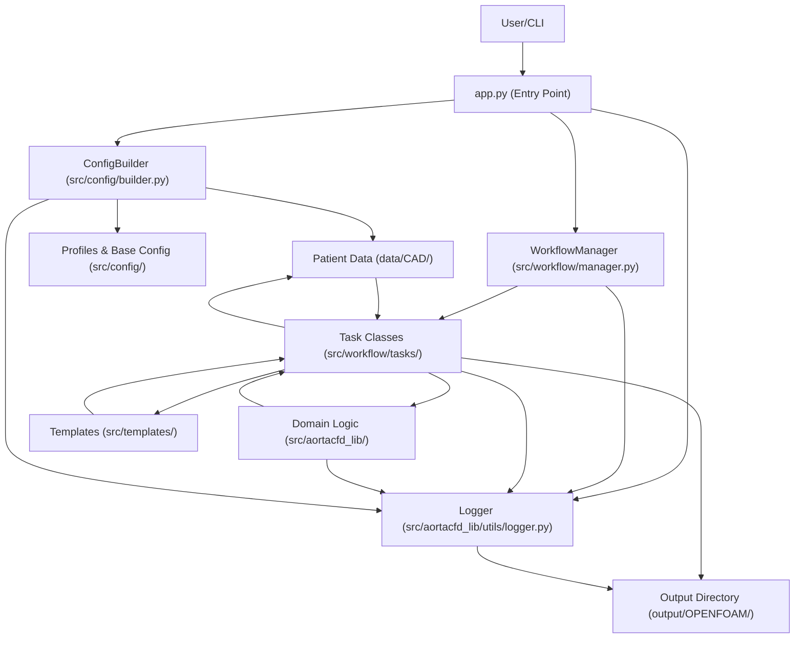

# AortaCFD: Patient-Specific Aortic Blood Flow Simulation

---

## Table of Contents
- [What Problem Does This App Solve?](#what-problem-does-this-app-solve)
- [Core Benefits](#core-benefits)
- [Features](#features)
- [Project Structure](#project-structure)
- [System Requirements](#system-requirements)
- [Pipeline & Architecture Overview](#pipeline--architecture-overview)
- [Installation](#installation)
- [Getting Started](#getting-started)
- [Command Reference](#command-reference)
- [Input Data Structure](#input-data-structure)
- [Web Interface](#web-interface)
- [Known Issues](#known-issues)
- [Updates & Roadmap](#updates--roadmap)
- [Contributing](#contributing)
- [License](#license)

---

## What Problem Does This App Solve?

**AortaCFD** addresses the challenge of performing patient-specific aortic blood flow simulations, which are often complex, time-consuming, and require deep expertise in both medical imaging and computational fluid dynamics (CFD). Existing tools can be difficult for clinicians and researchers to use, especially when setting up advanced boundary conditions like Windkessel models. AortaCFD streamlines the entire workflow—from geometry preparation to simulation and post-processing—making advanced hemodynamic analysis accessible, reproducible, and efficient.

---

## Core Benefits

- **End-to-End Automation:** Automates the full pipeline from geometry to results, reducing manual errors and setup time.
- **User-Friendly:** Simplifies complex CFD workflows for clinicians and researchers.
- **Advanced Boundary Conditions:** Supports three-element Windkessel (3EWK) models for physiologically realistic simulations ([see requirements](#system-requirements)).
- **Extensible & Modular:** Built in Python with a clear, task-based architecture for easy customization.
- **Reproducible Science:** Ensures all steps are logged and repeatable, supporting robust scientific research.

See [Features](#features) for a detailed breakdown.

---

## Features

- Automated case directory and file structure creation
- Mesh generation from STL geometry
- Automated boundary condition setup (including Windkessel models)
- Physical and numerical property file generation
- Parallel and serial solver execution
- Integrated post-processing with ParaView scripts
- Modular, extensible Python codebase

---

## Project Structure

AortaCFD follows a clean, modular architecture with clear separation of concerns:

```
AortaCFD-app/
├── src/                    # Core application source code
│   ├── aortacfd_lib/      # CFD computational library
│   │   ├── mesh_setup.py         # Mesh generation utilities
│   │   ├── boundary_condition_setup.py  # Boundary condition management
│   │   ├── physical_properties_setup.py # Physics configuration
│   │   ├── solver_setup.py       # OpenFOAM solver configuration
│   │   ├── post_processor.py     # ParaView post-processing
│   │   ├── hemodynamic_analyzer.py # Hemodynamic analysis tools
│   │   ├── quantitative_analysis.py # Quantitative flow analysis
│   │   └── utils/               # Common utilities (logger, runner, etc.)
│   ├── workflow/          # Task-based workflow orchestration
│   │   ├── manager.py           # Main workflow coordinator
│   │   ├── base_task.py         # Abstract task base class
│   │   └── tasks/              # Individual workflow tasks
│   ├── config/            # Configuration management
│   │   ├── builder.py           # Dynamic config builder
│   │   ├── base.py             # Base configuration
│   │   └── profiles/           # Simulation profiles
│   └── templates/         # OpenFOAM template files
├── cases_input/           # Input patient cases
│   ├── patient1/         # Example patient case 1
│   └── patient2/         # Example patient case 2
├── output/                # Generated simulation results
│   └── patient*/         # Results organized by patient
├── tests/                 # Comprehensive test suite
├── run_patient.py         # Main patient-specific runner
├── simple_run.py          # Simplified one-command runner
└── requirements.txt       # Python dependencies
```

### Key Benefits of This Structure:
- **Modular Design**: Each component has a clear, single responsibility
- **Separation of Concerns**: Core logic, patient data, and output are clearly separated
- **Easy Development**: Source code organized logically for maintainability
- **User-Friendly**: Simple patient-based organization with templated configurations
- **Clean Testing**: Test organization mirrors source structure

---

## System Requirements

- **OpenFOAM** (Foundation version 12 recommended)
- **ParaView** (for post-processing, including `pvbatch`)
- **modularWKPressure** boundary condition for 3-element Windkessel models (optional)

### OpenFOAM Version Support

AortaCFD is optimized for OpenFOAM 12 with modern features:

- **OpenFOAM 12** (Foundation) - Recommended version with latest features
- Uses `foamRun -solver incompressibleFluid` instead of deprecated `pimpleFoam`
- Supports modern boundary conditions including `modularWKPressure`

The system automatically configures templates and solver settings for OpenFOAM 12.

[See Installation](#installation) for setup instructions.

### Installing OpenFOAM (Ubuntu Example)

#### OpenFOAM 12 (Recommended)
```bash
# Add the OpenFOAM repository and install
sudo sh -c "wget -O - https://dl.openfoam.org/gpg.key | apt-key add -"
sudo add-apt-repository http://dl.openfoam.org/ubuntu
sudo apt-get update
sudo apt-get install openfoam12

# Add OpenFOAM 12 to your environment (add this to your ~/.bashrc)
source /opt/openfoam12/etc/bashrc
```

### Installing ParaView (pvbatch)

You can install ParaView from your package manager or from the [official ParaView website](https://www.paraview.org/download/). Ensure the `pvbatch` executable is available in your PATH.

### Windkessel Model Support

AortaCFD supports 3-element Windkessel (3EWK) boundary conditions for physiologically realistic outlet modeling:

#### OpenFOAM 12 Windkessel
For OpenFOAM 12, use the modern `modularWKPressure` boundary condition:

```bash
# Use the provided installation script
./scripts/install_windkessel_of12.sh

# Or install manually:
git clone https://github.com/EManchester/OpenFOAM-v12-Windkessel-code.git
cd OpenFOAM-v12-Windkessel-code
wmake
```

The OpenFOAM 12 implementation offers:
- **Modular design**: No custom solver required
- **Better integration**: Works with `foamRun -solver incompressibleFluid`
- **Improved stability**: Enhanced numerical implementation
- **Easier setup**: Parameters defined directly in boundary conditions
- **Murray's Law Support**: Automatic flow distribution based on vessel geometry

---

## Pipeline & Architecture Overview

AortaCFD is built around a modular, task-based pipeline managed by the `WorkflowManager`. Each workflow command triggers a sequence of tasks, ensuring reproducibility and clarity.

**Pipeline vs. Architecture:**
- The **pipeline** describes the sequence of steps (tasks) performed for a simulation.
- The **architecture** shows how the main components of the codebase interact to enable this pipeline.

### Pipeline Overview

# (Remove the mermaid pipeline diagram block here)

### Architecture Flow Map



---

## Installation

### Quick Setup (Recommended)

1. **Clone the repository:**
   ```bash
   git clone https://github.com/yourusername/AortaCFD-app.git
   cd AortaCFD-app
   ```

2. **Create and activate virtual environment:**
   ```bash
   python3 -m venv venv
   source venv/bin/activate
   ```

3. **Install Python dependencies:**
   ```bash
   pip install --upgrade pip
   pip install -r requirements.txt
   ```

### Manual Installation

If you prefer manual setup or encounter issues with the automated script:

1. **Install system dependencies:**
   ```bash
   sudo apt update
   sudo apt install python3-venv python3-full
   ```

2. **Create and activate virtual environment:**
   ```bash
   python3 -m venv venv
   source venv/bin/activate
   ```

3. **Install Python dependencies:**
   ```bash
   pip install --upgrade pip
   pip install -r requirements.txt
   ```

### OpenFOAM Installation

4. **Install OpenFOAM** (choose your version):
   
   See [System Requirements](#system-requirements) for detailed OpenFOAM installation instructions.

### Troubleshooting

**If you see "externally-managed-environment" error:**
- This is a safety feature in newer Python installations
- **Always use a virtual environment** (recommended approach above)
- Never use `--break-system-packages` as it can damage your system

**Virtual Environment Best Practices:**
- Always activate the environment before running AortaCFD: `source venv/bin/activate`
- Deactivate when done: `deactivate`
- The `venv/` directory is excluded from git (see `.gitignore`)

---

## Getting Started

1. **Activate the virtual environment:**
   ```bash
   source venv/bin/activate
   ```

2. **Prepare your case data:**
   - Place STL geometry files in a patient folder under `cases_input/` (e.g., `cases_input/patient1/`)
   - Include inlet flow CSV file and boundary conditions JSON in the same folder
   - Configure simulation settings in `cfd_template.json`

3. **Run a simulation:**
   ```bash
   # Run a specific patient case
   python run_patient.py patient1
   
   # Quick run with reduced iterations
   python run_patient.py patient1 --quick
   
   # Simple one-command run from any folder
   python simple_run.py /path/to/stl/files
   ```

4. **For 3EWK (three-element Windkessel) boundary conditions:**
   
   - Install `modularWKPressure` boundary condition: `./scripts/install_windkessel_of12.sh`
   - Configure outlets in `boundary_conditions.json` with type "3EWINDKESSEL"
   - The solver automatically uses `foamRun -solver incompressibleFluid`

5. **Results and logs will be generated in the `output/patient*/` directory.**

6. **When finished, deactivate the virtual environment:**
   ```bash
   deactivate
   ```

---

## Command Reference

### Patient-Specific Runner (`run_patient.py`)

| Command                                    | Description                                      |
|--------------------------------------------|--------------------------------------------------|
| `python run_patient.py patient1`          | Run full CFD analysis for patient1             |
| `python run_patient.py patient1 --quick`  | Quick run with reduced iterations              |
| `python run_patient.py --list`            | List all available patient cases              |

### Simple Runner (`simple_run.py`)

| Command                                    | Description                                      |
|--------------------------------------------|--------------------------------------------------|
| `python simple_run.py /path/to/files`     | Auto-detect and run CFD on STL files          |

### CLI Arguments

| Argument        | Description                                      | Required |
|----------------|--------------------------------------------------|----------|
| `patient_name` | Name of patient folder in cases_input/          | Yes      |
| `--quick`      | Reduce iterations for faster testing            | No       |
| `--list`       | Show available patient cases                     | No       |

**Examples:**
```bash
# List available patients
python run_patient.py --list

# Run full analysis
python run_patient.py patient1

# Quick test run
python run_patient.py patient1 --quick

# Simple one-command run
python simple_run.py ~/my_stl_files/

# Help
python run_patient.py --help
```

---

## Input Data Structure

- `cases_input/<patient_name>/`
  - `inlet.stl`, `outlet1.stl`, ..., `wall_aorta.stl`
  - `BPM*.csv` (inlet flow rate data)
  - `boundary_conditions.json`
  - `cfd_template.json` (simulation configuration)
- `src/config/profiles/<profile_name>.py`
  - Pre-defined simulation profiles (mesh, physics, solver settings)

### Example Case Structure
```
cases_input/patient1/
├── inlet.stl              # Inlet geometry
├── outlet1.stl            # Outlet 1 geometry
├── outlet2.stl            # Outlet 2 geometry  
├── outlet3.stl            # Outlet 3 geometry
├── outlet4.stl            # Outlet 4 geometry
├── wall_aorta.stl         # Aortic wall geometry
├── BPM75.csv              # Inlet flow rate at 75 BPM
├── boundary_conditions.json        # Boundary condition settings
└── cfd_template.json               # Simulation parameters
```

### Windkessel Configuration Examples

**boundary_conditions.json with automatic Murray's Law:**
```json
{
  "inlet": {
    "type": "TIMEVARYING",
    "csv_file": "BPM120.csv",
    "data_type": "velocity",
    "profile": "plug_flow",
    "orientation": "out"
  },
  "outlets": {
    "type": "3EWINDKESSEL",
    "windkessel_settings": {
      "systolic_pressure": 120,
      "diastolic_pressure": 80,
      "methodology": "murray_law_automatic"
    }
  }
}
```

This configuration automatically:
- Calculates outlet flow ratios using Murray's Law
- Computes Windkessel parameters (R, C, Z) based on pressure targets
- Sets up proper boundary conditions for each outlet

---

## Advanced Features

### Hemodynamic Analysis

AortaCFD includes advanced hemodynamic analysis capabilities:

- **Quantitative Analysis**: Wall shear stress, pressure drop, and flow patterns
- **Performance Optimization**: Automatic mesh and solver optimization
- **Publication Reporting**: Generate research-ready reports and figures

### Analysis Tools

```bash
# View analysis capabilities
python -c "from src.aortacfd_lib.hemodynamic_analyzer import HemodynamicAnalyzer; help(HemodynamicAnalyzer)"

# Generate publication-quality reports
python -c "from src.aortacfd_lib.publication_reporter import PublicationReporter; help(PublicationReporter)"
```

---

## Known Issues

- Ensure all required STL and CSV files are present in the case directory.
- For Windkessel models, check that flow split ratios sum to 1.0.
- LES simulations require a fine mesh profile for best results.
- For 3EWK, ensure the custom solver and boundary files are set up as per [OpenFOAM-v8-Windkessel-code](https://github.com/EManchester/OpenFOAM-v8-Windkessel-code).

---

## Updates & Roadmap

- **v1.0:** Initial public release with CLI interface
- **v1.1:** Project restructuring with modular architecture (completed)
  - Separated core application (`src/`) from web interface (`web/`)
  - Clean data organization (`data/` for inputs, `output/` for results)
  - Improved testing infrastructure
- **v1.2:** OpenFOAM 12 optimization (completed)
  - Full OpenFOAM 12 support with modern solver architecture
  - Murray's Law automatic flow distribution
  - Improved numerical stability for coarse meshes
  - Enhanced boundary condition handling
- **Planned Features:**
  - Multi-patient batch processing capabilities
  - Enhanced web interface with real-time monitoring
  - Docker containerization for easy deployment
  - Cloud deployment support (AWS, Azure, GCP)
  - Advanced post-processing and visualization tools
  - Integration with medical imaging workflows (DICOM support)

---

## Contributing

Contributions are welcome! Please open issues or pull requests for bug fixes, new features, or documentation improvements.

---

## License

[MIT License](LICENSE)

---

**For more information, see the [Documentation](#) or contact [jie.wang-2@manchester.ac.uk](mailto:jie.wang-2@manchester.ac.uk).**
