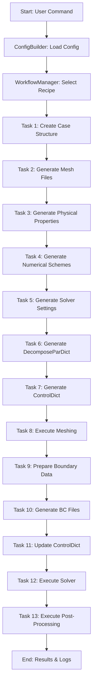

# AortaCFD: Patient-Specific Aortic Blood Flow Simulation

---

## Table of Contents
- [What Problem Does This App Solve?](#what-problem-does-this-app-solve)
- [Core Benefits](#core-benefits)
- [Features](#features)
- [System Requirements](#system-requirements)
- [Pipeline Architecture](#pipeline-architecture)
- [Installation](#installation)
- [Getting Started](#getting-started)
- [Command Reference](#command-reference)
- [Input Data Structure](#input-data-structure)
- [Known Issues](#known-issues)
- [Updates & Roadmap](#updates--roadmap)
- [Contributing](#contributing)
- [License](#license)

---

## What Problem Does This App Solve?

**AortaCFD** addresses the challenge of performing patient-specific aortic blood flow simulations, which are often complex, time-consuming, and require deep expertise in both medical imaging and computational fluid dynamics (CFD). Existing tools can be difficult for clinicians and researchers to use, especially when setting up advanced boundary conditions like Windkessel models. AortaCFD streamlines the entire workflow—from geometry preparation to simulation and post-processing—making advanced hemodynamic analysis accessible, reproducible, and efficient.

---

## Core Benefits

- **End-to-End Automation:** Automates the full pipeline from geometry to results, reducing manual errors and setup time.
- **User-Friendly:** Simplifies complex CFD workflows for clinicians and researchers.
- **Advanced Boundary Conditions:** Supports three-element Windkessel (3EWK) models for physiologically realistic simulations ([see requirements](#system-requirements)).
- **Extensible & Modular:** Built in Python with a clear, task-based architecture for easy customization.
- **Reproducible Science:** Ensures all steps are logged and repeatable, supporting robust scientific research.

See [Features](#features) for a detailed breakdown.

---

## Features

- Automated case directory and file structure creation
- Mesh generation from STL geometry
- Automated boundary condition setup (including Windkessel models)
- Physical and numerical property file generation
- Parallel and serial solver execution
- Integrated post-processing with ParaView scripts
- Modular, extensible Python codebase

---

## System Requirements

- **OpenFOAM 8** (must be installed and sourced)
- **ParaView** (for post-processing, including `pvbatch`)
- **pimpleFOAM_WK** solver for 3-element Windkessel boundary conditions ([see Windkessel code repo](https://github.com/EManchester/OpenFOAM-v8-Windkessel-code))

[See Installation](#installation) for setup instructions.

### Installing OpenFOAM 8 (Ubuntu Example)

```bash
# Add the OpenFOAM repository and install
sudo sh -c "wget -O - https://dl.openfoam.org/gpg.key | apt-key add -"
sudo add-apt-repository http://dl.openfoam.org/ubuntu
sudo apt-get update
sudo apt-get install openfoam8

# Add OpenFOAM to your environment (add this to your ~/.bashrc)
source /opt/openfoam8/etc/bashrc
```

### Installing ParaView (pvbatch)

You can install ParaView from your package manager or from the [official ParaView website](https://www.paraview.org/download/). Ensure the `pvbatch` executable is available in your PATH.

### Compiling the Windkessel Solver (pimpleFOAM_WK)

For simulations using the 3-element Windkessel (3EWK) boundary condition, you must compile and use the custom `pimpleFOAM_WK` solver:

1. Clone the Windkessel solver repository:
   ```bash
   git clone https://github.com/EManchester/OpenFOAM-v8-Windkessel-code.git
   cd OpenFOAM-v8-Windkessel-code
   wmake
   ```
   This will create the `pimpleFOAM_WK` solver in your `$FOAM_USER_APPBIN` directory.

2. Ensure your case and boundary files are set up as described in the [Windkessel code README](https://github.com/EManchester/OpenFOAM-v8-Windkessel-code/blob/main/README.md).

---

## Pipeline Architecture

AortaCFD is built around a modular, task-based pipeline managed by the `WorkflowManager`. Each workflow command triggers a sequence of tasks, ensuring reproducibility and clarity.

**Pipeline Overview:**



**Key Pipeline Commands:**

- `setup:dict`: Generate all non-mesh-dependent dictionary files.
- `setup:bc`: Prepare and update boundary condition files after meshing.
- `run:mesh`: Execute OpenFOAM meshing utilities.
- `run:solver`: Run the OpenFOAM solver (or `pimpleFOAM_WK` for 3EWK cases).
- `createCase`: Full setup (structure, mesh, properties, BCs).
- `runAll`: Complete end-to-end workflow (setup, mesh, BCs, solve, post-process).

Each task is implemented as a Python class, ensuring modularity and easy extension.

---

## Installation

1. **Clone the repository:**
   ```bash
   git clone https://github.com/yourusername/AortaCFD-app.git
   cd AortaCFD-app
   ```

2. **Install Python dependencies:**
   ```bash
   pip install -r requirement.txt
   ```

3. **Ensure OpenFOAM 8, ParaView, and (if using 3EWK) pimpleFOAM_WK are installed and available in your environment.**

[See System Requirements](#system-requirements) for details.

---

## Getting Started

1. **Prepare your case data:**
   - Place STL geometry and inlet flow CSVs in a subfolder under `CAD/`.
   - Prepare a simulation profile in `config/profiles/`.

2. **Run a workflow command:**
   ```bash
   python app.py runAll --case PAT1_2024 --profile sim_laminar_fine
   ```

   - Use `--clean` to remove previous results and start fresh.

3. **For 3EWK (three-element Windkessel) boundary conditions:**
   - Ensure you have compiled and are using the `pimpleFOAM_WK` solver from [OpenFOAM-v8-Windkessel-code](https://github.com/EManchester/OpenFOAM-v8-Windkessel-code).
   - Follow the Windkessel code's instructions for setting up boundary conditions and `windkesselProperties`.

4. **Results and logs will be generated in the `OPENFOAM/` directory.**

---

## Command Reference

| Command         | Description                                      |
|-----------------|--------------------------------------------------|
| setup:dict      | Generate all dictionary files (pre-mesh)         |
| setup:bc        | Prepare and update boundary condition files       |
| run:mesh        | Run OpenFOAM meshing utilities                   |
| run:solver      | Run the OpenFOAM solver (or pimpleFOAM_WK)       |
| createCase      | Full setup (structure, mesh, properties, BCs)    |
| runAll          | Complete end-to-end workflow                     |

**Example:**
```bash
python app.py runAll --case PAT1_2024 --profile sim_laminar_fine --clean
```

---

## Input Data Structure

- `CAD/<case_name>/`
  - `inlet.stl`, `outlet1.stl`, ..., `wall_aorta.stl`
  - `inletFlowRate.csv`
  - `boundary_conditions.json` (optional)
- `config/profiles/<profile_name>.py`
  - Simulation profile (mesh, physics, solver settings)

---

## Known Issues

- Ensure all required STL and CSV files are present in the case directory.
- For Windkessel models, check that flow split ratios sum to 1.0.
- LES simulations require a fine mesh profile for best results.
- For 3EWK, ensure the custom solver and boundary files are set up as per [OpenFOAM-v8-Windkessel-code](https://github.com/EManchester/OpenFOAM-v8-Windkessel-code).

---

## Updates & Roadmap

- **v1.0:** Initial public release
- **Planned:** Multi-patient batch processing, GUI front-end, cloud deployment

---

## Contributing

Contributions are welcome! Please open issues or pull requests for bug fixes, new features, or documentation improvements.

---

## License

[MIT License](LICENSE)

---

**For more information, see the [Documentation](#) or contact [jie.wang-2@manchester.ac.uk](mailto:jie.wang-2@manchester.ac.uk).**
