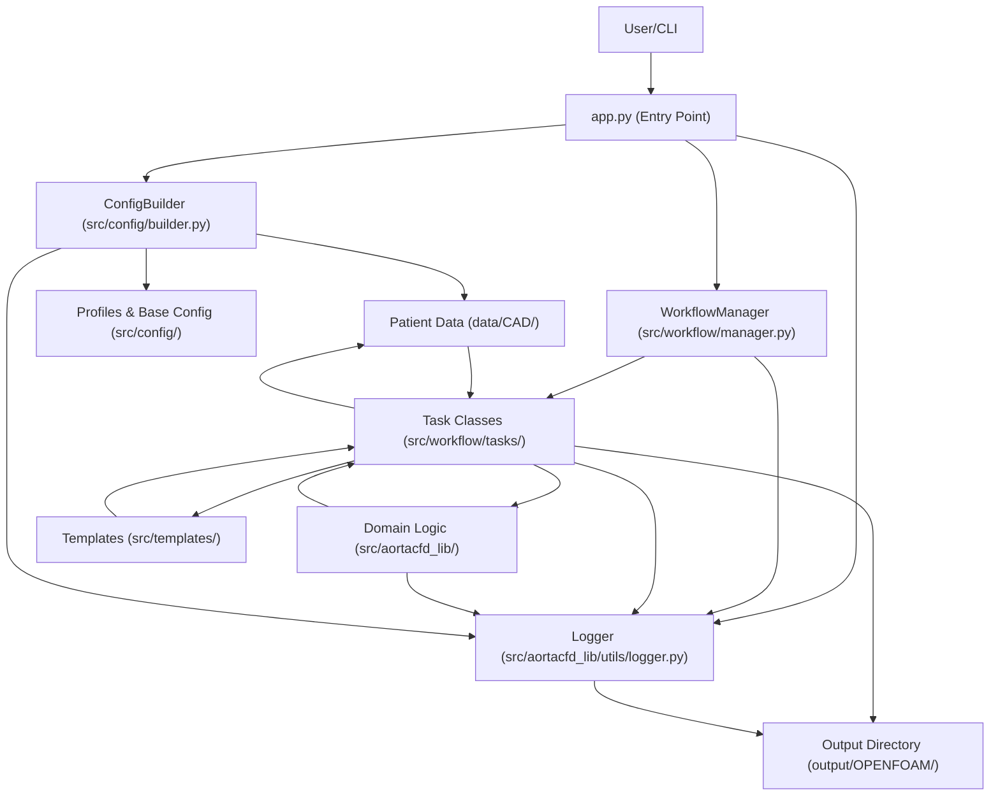

# AortaCFD: Patient-Specific Aortic Blood Flow Simulation


---

## Table of Contents
- [What Problem Does This App Solve?](#what-problem-does-this-app-solve)
- [Core Benefits](#core-benefits)
- [Features](#features)
- [Documentation](#documentation)
- [Project Structure](#project-structure)
- [System Requirements](#system-requirements)
- [Pipeline & Architecture Overview](#pipeline--architecture-overview)
- [Installation](#installation)
- [Getting Started](#getting-started)
- [Command Reference](#command-reference)
- [Input Data Structure](#input-data-structure)
- [Testing](#testing)
- [Advanced Features](#advanced-features)
- [Known Issues](#known-issues)
- [Updates & Roadmap](#updates--roadmap)
- [Contributing](#contributing)
- [License](#license)

---

## What Problem Does This App Solve?

**AortaCFD** addresses the challenge of performing patient-specific aortic blood flow simulations, which are often complex, time-consuming, and require deep expertise in both medical imaging and computational fluid dynamics (CFD). Existing tools can be difficult for clinicians and researchers to use, especially when setting up advanced boundary conditions like Windkessel models. AortaCFD streamlines the entire workflow—from geometry preparation to simulation and post-processing—making advanced hemodynamic analysis accessible, reproducible, and efficient.

---

## Core Benefits

- **End-to-End Automation:** Automates the full pipeline from geometry to results, reducing manual errors and setup time.
- **User-Friendly:** Simplifies complex CFD workflows for clinicians and researchers.
- **Advanced Boundary Conditions:** Supports three-element Windkessel (3EWK) models for physiologically realistic simulations ([see requirements](#system-requirements)).
- **Extensible & Modular:** Built in Python with a clear, task-based architecture for easy customization.
- **Reproducible Science:** Ensures all steps are logged and repeatable, supporting robust scientific research.

See [Features](#features) for a detailed breakdown.

---

## Documentation

* **[USER_GUIDE.md](USER_GUIDE.md)** - Complete user guide covering:
  * Quick start and installation
  * Configuration and boundary conditions
  * Mesh settings and troubleshooting
  * Testing and validation

* **[CLAUDE.md](CLAUDE.md)** - Developer/AI assistant guide with implementation details

* **[CHANGELOG.md](CHANGELOG.md)** - Version history and updates

---

## Features

- **Two-Stage Mesh Optimization**: Physics-aware mesh generation for accurate CFD results
- Automated case directory and file structure creation
- Advanced mesh generation with QoI-driven adaptation
- Automated boundary condition setup (including Windkessel models)
- Physical and numerical property file generation
- Parallel and serial solver execution
- Integrated post-processing with ParaView scripts
- Modular, extensible Python codebase

---

## Project Structure

AortaCFD follows a clean, modular architecture with clear separation of concerns:

```
AortaCFD-app/
├── src/                    # Core application source code
│   ├── aortacfd_lib/      # CFD computational library
│   │   ├── mesh_setup.py         # Mesh generation utilities
│   │   ├── boundary_condition_setup.py  # Boundary condition management
│   │   ├── physical_properties_setup.py # Physics configuration
│   │   ├── solver_setup.py       # OpenFOAM solver configuration
│   │   ├── post_processor.py     # ParaView post-processing
│   │   ├── hemodynamic_analyzer.py # Hemodynamic analysis tools
│   │   ├── quantitative_analysis.py # Quantitative flow analysis
│   │   └── utils/               # Common utilities (logger, runner, etc.)
│   ├── workflow/          # Task-based workflow orchestration
│   │   ├── manager.py           # Main workflow coordinator
│   │   ├── base_task.py         # Abstract task base class
│   │   └── tasks/              # Individual workflow tasks
│   ├── config/            # Configuration management
│   │   ├── builder.py           # Dynamic config builder
│   │   ├── base.py             # Base configuration
│   │   └── profiles/           # Simulation profiles
│   └── templates/         # OpenFOAM template files
├── mesh_optim/            # Advanced mesh optimization package
│   ├── stage1_mesh.py     # Geometry-driven mesh generation (inner loop)
│   ├── stage2_qoi.py      # QoI-driven mesh adaptation (outer loop)
│   ├── utils.py           # Mesh optimization utilities
│   ├── __main__.py        # CLI interface
│   └── configs/           # Physics-aware configurations
│       ├── stage1_default.json    # Baseline geometry-driven settings
│       ├── stage2_laminar.json    # Laminar flow QoI criteria
│       ├── stage2_rans.json       # RANS flow QoI criteria
│       └── stage2_les.json        # LES flow QoI criteria
├── cases_input/           # Input patient cases
│   ├── patient1/         # Example patient case 1
│   └── patient2/         # Example patient case 2
├── tests/                 # Comprehensive test suite
├── run_patient.py         # Main patient-specific runner
├── simple_run.py          # Simplified one-command runner
└── requirements.txt       # Python dependencies
```

### Key Benefits of This Structure:
- **Modular Design**: Each component has a clear, single responsibility
- **Separation of Concerns**: Core logic, patient data, and output are clearly separated
- **Easy Development**: Source code organized logically for maintainability
- **User-Friendly**: Simple patient-based organization with templated configurations
- **Clean Testing**: Test organization mirrors source structure

---

## System Requirements

- **OpenFOAM** (Foundation version 12 recommended)
- **ParaView** (for post-processing, including `pvbatch`)
- **modularWKPressure** boundary condition for 3-element Windkessel models (optional)

### OpenFOAM Version Support

AortaCFD is optimized for OpenFOAM 12 with modern features:

- **OpenFOAM 12** (Foundation) - Recommended version with latest features
- Uses `foamRun -solver incompressibleFluid` instead of deprecated `pimpleFoam`
- Supports modern boundary conditions including `modularWKPressure`

The system automatically configures templates and solver settings for OpenFOAM 12.

[See Installation](#installation) for setup instructions.

### Installing OpenFOAM (Ubuntu Example)

#### OpenFOAM 12 (Recommended)
```bash
# Add the OpenFOAM repository and install
sudo sh -c "wget -O - https://dl.openfoam.org/gpg.key | apt-key add -"
sudo add-apt-repository http://dl.openfoam.org/ubuntu
sudo apt-get update
sudo apt-get install openfoam12

# Add OpenFOAM 12 to your environment (add this to your ~/.bashrc)
source /opt/openfoam12/etc/bashrc
```

### Installing ParaView (pvbatch)

You can install ParaView from your package manager or from the [official ParaView website](https://www.paraview.org/download/). Ensure the `pvbatch` executable is available in your PATH.

### Windkessel Model Support

AortaCFD supports 3-element Windkessel (3EWK) boundary conditions for physiologically realistic outlet modeling:

#### OpenFOAM 12 Windkessel
For OpenFOAM 12, use the modern `modularWKPressure` boundary condition:

```bash
# Use the provided installation script
./scripts/install_windkessel_of12.sh

# Or install manually:
git clone https://github.com/JieWangnk/OpenFOAM-WK.git
cd OpenFOAM-WK
wmake
```

The OpenFOAM 12 implementation offers:
- **Modular design**: No custom solver required
- **Better integration**: Works with `foamRun -solver incompressibleFluid`
- **Improved stability**: Enhanced numerical implementation
- **Easier setup**: Parameters defined directly in boundary conditions
- **Murray's Law Support**: Automatic flow distribution based on vessel geometry

---

## Pipeline & Architecture Overview

AortaCFD is built around a modular, task-based pipeline managed by the `WorkflowManager`. Each workflow command triggers a sequence of tasks, ensuring reproducibility and clarity.

**Pipeline vs. Architecture:**
- The **pipeline** describes the sequence of steps (tasks) performed for a simulation.
- The **architecture** shows how the main components of the codebase interact to enable this pipeline.

### Pipeline Overview

# (Remove the mermaid pipeline diagram block here)

### Architecture Flow Map



---

## Installation

### Quick Setup (Recommended)

1. **Clone the repository:**
   ```bash
   git clone https://github.com/yourusername/AortaCFD-app.git
   cd AortaCFD-app
   ```

2. **Create and activate virtual environment:**
   ```bash
   python3 -m venv venv
   source venv/bin/activate
   ```

3. **Install Python dependencies:**
   ```bash
   pip install --upgrade pip
   pip install -r requirements.txt
   ```

### Manual Installation

If you prefer manual setup or encounter issues with the automated script:

1. **Install system dependencies:**
   ```bash
   sudo apt update
   sudo apt install python3-venv python3-full
   ```

2. **Create and activate virtual environment:**
   ```bash
   python3 -m venv venv
   source venv/bin/activate
   ```

3. **Install Python dependencies:**
   ```bash
   pip install --upgrade pip
   pip install -r requirements.txt
   ```

### OpenFOAM Installation

4. **Install OpenFOAM** (choose your version):
   
   See [System Requirements](#system-requirements) for detailed OpenFOAM installation instructions.

### Troubleshooting

**If you see "externally-managed-environment" error:**
- This is a safety feature in newer Python installations
- **Always use a virtual environment** (recommended approach above)
- Never use `--break-system-packages` as it can damage your system

**Virtual Environment Best Practices:**
- Always activate the environment before running AortaCFD: `source venv/bin/activate`
- Deactivate when done: `deactivate`
- The `venv/` directory is excluded from git (see `.gitignore`)

---

## Getting Started

1. **Activate the virtual environment:**
   ```bash
   source venv/bin/activate
   ```

2. **Prepare your case data:**
   - Place STL geometry files in a patient folder under `cases_input/` (e.g., `cases_input/patient1/`)
   - Include inlet flow CSV file and boundary conditions JSON in the same folder
   - Configure simulation settings in `cfd_template.json`

3. **Run a simulation:**
   ```bash
   # Run a specific patient case
   python run_patient.py patient1
   
   # Quick run with reduced iterations
   python run_patient.py patient1 --quick

   # Run with a custom configuration JSON
    python run_patient.py patient1 --config /path/to/config_override.json
   
   # Simple one-command run from any folder
   python simple_run.py /path/to/stl/files
   ```

4. **For 3EWK (three-element Windkessel) boundary conditions:**
   
   - Install `modularWKPressure` boundary condition: `./scripts/install_windkessel_of12.sh`
   - Configure outlets in `boundary_conditions.json` with type "3EWINDKESSEL"
   - Velocity outlets are emitted as `stabilizedWindkesselVelocity` with stabilization enabled by default
   - Pressure outlets use `modularWKPressure` and the solver automatically runs `foamRun -solver incompressibleFluid`

5. **Results and logs will be generated in the `output/patient*/` directory.**

6. **When finished, deactivate the virtual environment:**
   ```bash
   deactivate
   ```

---

## Command Reference

### Patient-Specific Runner (`run_patient.py`)

| Command                                    | Description                                      |
|--------------------------------------------|--------------------------------------------------|
| `python run_patient.py patient1`          | Run full CFD analysis for patient1             |
| `python run_patient.py patient1 --quick`  | Quick run with reduced iterations              |
| `python run_patient.py patient1 --config custom.json` | Use an alternate configuration file             |
| `python run_patient.py --list`            | List all available patient cases              |

### Advanced Mesh Optimization (`mesh_optim`)

| Command                                    | Description                                      |
|--------------------------------------------|--------------------------------------------------|
| `python -m mesh_optim stage1 --geometry cases_input/patient1` | Geometry-driven mesh optimization (novice-friendly) |
| `python -m mesh_optim stage2 --geometry cases_input/patient1 --model RANS` | Physics-aware RANS mesh with y+ ≈ 1 targeting |
| `python -m mesh_optim stage2 --geometry cases_input/patient1 --model LES`  | Wall-resolved LES mesh optimization |
| `python -m mesh_optim stage2 --geometry cases_input/patient1 --model LAMINAR` | Laminar flow mesh optimization |

### Simple Runner (`simple_run.py`)

| Command                                    | Description                                      |
|--------------------------------------------|--------------------------------------------------|
| `python simple_run.py /path/to/files`     | Auto-detect and run CFD on STL files          |

### CLI Arguments

| Argument        | Description                                      | Required |
|----------------|--------------------------------------------------|----------|
| `patient_name` | Name of patient folder in cases_input/          | Yes      |
| `--quick`      | Reduce iterations for faster testing            | No       |
| `--list`       | Show available patient cases                     | No       |
| `--config PATH`| Override default cases_input/<patient>/config.json | No    |

**Examples:**
```bash
# List available patients
python run_patient.py --list

# Run full analysis
python run_patient.py patient1

# Quick test run
python run_patient.py patient1 --quick

# Simple one-command run
python simple_run.py ~/my_stl_files/

# Advanced mesh optimization for RANS
python -m mesh_optim stage2 --geometry cases_input/patient1 --model RANS

# Help
python run_patient.py --help
python -m mesh_optim stage1 --help
```

---

## Advanced Mesh Optimization

AortaCFD includes a sophisticated two-stage mesh optimization system designed for physics-aware mesh generation with QoI (Quantities of Interest) targeting.

### Two-Stage Workflow

#### Stage 1: Geometry-Driven Mesh Generation (Inner Loop)
- **Purpose**: Generate quality mesh based purely on geometry
- **Target Users**: Novice users who need a reliable mesh quickly
- **Process**: Iterates on surface refinement and boundary layer settings until quality criteria are met
- **Output**: Mesh with good orthogonality, skewness, and boundary layer coverage

```bash
# Basic geometry-driven mesh
python -m mesh_optim stage1 --geometry cases_input/patient1

# With custom settings
python -m mesh_optim stage1 --geometry cases_input/patient1 --config mesh_optim/configs/stage1_default.json --max-iterations 5
```

#### Stage 2: QoI-Driven Mesh Adaptation (Outer Loop)  
- **Purpose**: Physics-aware mesh optimization with CFD validation
- **Target Users**: Advanced users requiring production-quality meshes
- **Process**: Runs Stage 1, then iteratively solves CFD and adapts mesh based on y+, WSS, and flow metrics
- **Output**: Mesh optimized for specific flow regime (Laminar/RANS/LES)

```bash
# Physics-aware RANS mesh with y+ ≈ 1 targeting
python -m mesh_optim stage2 --geometry cases_input/patient1 --model RANS

# Wall-resolved LES mesh
python -m mesh_optim stage2 --geometry cases_input/patient1 --model LES

# Custom configuration
python -m mesh_optim stage2 --geometry cases_input/patient1 --model RANS --config mesh_optim/configs/stage2_rans.json
```

### Physics-Aware Features

- **Actual y+ Targeting**: Uses patient-specific peak velocity (from BPM75.csv) and geometry to calculate proper first layer thickness for y+ ≈ 1
- **Flow Regime Optimization**: Different settings for Laminar (Re < 2300), RANS, and wall-resolved LES
- **Distance Refinement**: Physics-based refinement distances (1.5mm/3.0mm from wall) rather than arbitrary cell multiples  
- **QoI Convergence**: Monitors velocity stability, pressure drop accuracy, and WSS reliability

### Configuration Files

| File | Description | Target y+ | Layers | Use Case |
|------|-------------|-----------|---------|----------|
| `stage1_default.json` | Baseline geometry-driven | N/A | 10 | Quick prototyping |
| `stage2_laminar.json` | Laminar flow (Re < 2300) | < 1 | 8-10 | Steady laminar flow |
| `stage2_rans.json` | SST-RANS turbulence | 0.5-2.0 | 12-15 | Most clinical cases |  
| `stage2_les.json` | Wall-resolved LES | 0.3-1.5 | 20-25 | Research/high fidelity |

### Benefits Over Traditional Meshing

| Aspect | Traditional | AortaCFD Mesh Optimization |
|--------|-------------|----------------------------|
| **Layer Targeting** | Trial and error | Physics-based y+ = 1 calculation |
| **Distance Refinement** | Cell size multiples | Boundary layer physics (1.5/3.0mm) |
| **Quality Validation** | checkMesh only | CFD + QoI convergence |
| **Flow Regime** | One-size-fits-all | Regime-specific (Laminar/RANS/LES) |
| **Ease of Use** | Complex config files | Simple CLI commands |

---

## Input Data Structure

- `cases_input/<patient_name>/`
  - `inlet.stl`, `outlet1.stl`, ..., `wall_aorta.stl`
  - `BPM*.csv` (inlet flow rate data)
  - `boundary_conditions.json`
  - `cfd_template.json` (simulation configuration)
- `src/config/profiles/<profile_name>.py`
  - Pre-defined simulation profiles (mesh, physics, solver settings)

### Example Case Structure
```
cases_input/patient1/
├── inlet.stl              # Inlet geometry
├── outlet1.stl            # Outlet 1 geometry
├── outlet2.stl            # Outlet 2 geometry  
├── outlet3.stl            # Outlet 3 geometry
├── outlet4.stl            # Outlet 4 geometry
├── wall_aorta.stl         # Aortic wall geometry
├── BPM75.csv              # Inlet flow rate at 75 BPM
├── boundary_conditions.json        # Boundary condition settings
└── cfd_template.json               # Simulation parameters
```

### Windkessel Configuration Examples

**boundary_conditions.json with automatic Murray's Law:**
```json
{
  "inlet": {
    "type": "TIMEVARYING",
    "csv_file": "BPM120.csv",
    "data_type": "velocity",
    "profile": "plug_flow",
    "orientation": "out"
  },
  "outlets": {
    "type": "3EWINDKESSEL",
    "windkessel_settings": {
      "systolic_pressure": 120,
      "diastolic_pressure": 80,
      "methodology": "murray_law_automatic"
    }
  }
}
```

This configuration automatically:
- Calculates outlet flow ratios using Murray's Law
- Computes Windkessel parameters (R, C, Z) based on pressure targets
- Sets up proper boundary conditions for each outlet

### Boundary condition field reference

Example snippet from `cases_input/patient1/config.json`:

```json
"boundary_conditions": {
   "inlet": {
      "type": "TIMEVARYING",
      "csv_file": "test_cardio_profile.csv",
      "data_type": "velocity",
      "profile": "womersley",
      "orientation": "out"
   },
   "outlets": {
      "type": "3EWINDKESSEL",
      "windkessel_settings": {
         "systolic_pressure": 120,
         "diastolic_pressure": 80,
         "methodology": "murray_law_automatic"
      }
   },
   "walls": {
      "type": "no_slip",
      "roughness": 0.0
   }
}
```

| Field | Purpose | Consumed by |
| --- | --- | --- |
| `inlet.type` | Selects inlet handling mode (`TIMEVARYING`, `STEADY`, etc.) | `PrepareBoundaryDataTask` (see `src/workflow/tasks/setup_tasks.py`) |
| `inlet.csv_file` | CSV waveform stored in the patient folder | Copied into `constant/boundaryData/<inlet>` during case setup |
| `inlet.data_type` | `velocity` vs `flow` determines scaling | `CycleDataSetup` for inlet waveform normalization |
| `inlet.profile` | Radial profile (`womersley`, `plug_flow`, …) | `InletMapping` when mapping the CSV onto the inlet patch |
| `inlet.orientation` | Normal direction (`out`/`in`) | `EnhancedPointsFormatter` + inlet mapping ensures sign convention |
| `outlets.type` | Outlet BC family (`3EWINDKESSEL`, `pressure`, …) | `WkSetup` / outlet writers generate `windkesselProperties` or pressure BCs |
| `outlets.windkessel_settings` | Patient pressures, methodology, optional velocity BC tuning (`beta`, `enable_stabilization`) | Converted into Windkessel parameters in `constant/windkesselProperties` and velocity BC options |
| `walls.type` | Wall boundary condition type (`no_slip`, `slip`, etc.) | Initial condition writers for `0/U`, `0/p` |
| `walls.roughness` | Optional roughness scalar | Injected into wall-function entries of velocity BCs |

These mappings are implemented across the setup tasks. The main entry point is `PrepareBoundaryDataTask` in `src/workflow/tasks/setup_tasks.py`, which copies inlet data, formats patch sample points, and triggers the Windkessel setup helpers.

When `outlets.type` is `3EWINDKESSEL`, AortaCFD writes:

- Velocity BC: `stabilizedWindkesselVelocity` with defaults `beta = 1.0` and `enableStabilization = true`
- Pressure BC: `modularWKPressure` with the computed R/C/Z values

You can override the stabilization parameters globally or per outlet:

```json
"windkessel_settings": {
   "systolic_pressure": 120,
   "diastolic_pressure": 80,
   "beta": 0.8,
   "enable_stabilization": true,
   "velocity_bc": {
      "outlet3": { "beta": 0.6, "enable_stabilization": false }
   }
}
```

Global `beta` / `enable_stabilization` act as defaults, while entries under `velocity_bc` target individual outlets.

---

## Testing

AortaCFD includes a comprehensive test suite with **362 code tests** plus **CFD quality validation** covering unit, integration, end-to-end, and mesh quality validation with **100% pass rate** and **29% code coverage**.

### Quick Start

```bash
# Run all code tests (362 tests)
./venv/bin/pytest tests/ test_patient1_e2e.py test_multi_patient_e2e.py

# Run CFD quality validation (8 tests)
./venv/bin/pytest test_cfd_validation.py -v -s

# Run validation for all configs
python validation/run_validation.py patient1

# Run with coverage report
./venv/bin/pytest --cov=src --cov-report=html
firefox htmlcov/index.html

# Run unit tests only (302 tests)
./venv/bin/pytest tests/unit/ -v

# Run integration tests only (42 tests)
./venv/bin/pytest tests/integration/ -v

# Run end-to-end tests (18 tests)
./venv/bin/pytest test_patient1_e2e.py test_multi_patient_e2e.py -v
```

### Test Coverage (Updated 2025-10-02)

| Module | Coverage | Status |
|--------|----------|--------|
| inlet_mapping.py | 92% | ✅ Excellent |
| mesh_setup.py | 79% | ✅ Excellent |
| patch_processing.py | 72% | ✅ Excellent |
| setup_tasks.py | 56% | ✅ Good |
| murray_calculator.py | 46% | 🟡 Good |
| **Overall** | **29%** | 🟡 **Improving** |

### Test Organization

- **Unit Tests (302 tests):** Test individual components in isolation
  - inlet_mapping: 33 tests (profiles, geometry, orientation)
  - mesh_setup: 37 tests (geometry analysis, mesh generation)
  - murray_calculator: 34 tests (flow distribution, Murray's Law)
  - boundary_conditions: 27 tests (inlet/outlet BCs, Windkessel)

- **Integration Tests (42 tests):** Test complete workflows
  - config_workflow: 9 tests (configuration system)
  - mesh_workflow: 9 tests (mesh generation pipeline)
  - boundary_workflow: 9 tests (BC setup pipeline)
  - inlet_mapping_workflow: 7 tests (velocity profile workflows)
  - murray_flow_distribution: 15 tests (flow conservation, multi-outlet scenarios)

- **End-to-End Tests (18 tests):** Validate complete patient workflows
  - **Patient1 validation (9 tests):** Real STL geometry testing
    - Mesh generation and boundary condition setup
    - Murray's Law flow distribution with real patient data
    - Windkessel parameter calculation (R, C, Z coefficients)
    - Complete 6-step preprocessing workflow
  - **Multi-patient validation (9 tests):** Cross-patient testing
    - Patient2 complete workflow (laminar solver, Womersley profile)
    - Batch processing for multiple patients in parallel
    - Comparative geometric analysis across patients
    - Flow distribution comparison and consistency validation

- **CFD Quality Validation (8 tests):** User-perspective mesh quality testing
  - **Config validation (6 tests):** Test mesh quality for each solver/resolution
    - Laminar coarse/medium/fine mesh quality
    - RANS coarse/medium mesh quality with boundary layers
    - LES medium mesh quality with strict criteria
  - **Comparison tests (2 tests):** Config selection guidance
    - Cell count progression (coarse < medium < fine)
    - Solver type consistency validation

### Documentation

**Testing & Code Quality:**
- [TESTING.md](TESTING.md) - Comprehensive testing documentation
  - Test writing guidelines and templates
  - Fixture management best practices
  - Coverage analysis and improvement strategies
  - Debugging and CI/CD integration

**CFD Mesh Quality:**
- [docs/MESH_QUALITY_GUIDE.md](docs/MESH_QUALITY_GUIDE.md) - **Validated mesh settings guide**
  - Proven mesh configurations (COARSE, MEDIUM, FINE)
  - Quality metrics and troubleshooting
  - Design principles and best practices
  - Performance characteristics
- [docs/MESH_VALIDATION_RESULTS.md](docs/MESH_VALIDATION_RESULTS.md) - **Detailed validation results**
  - Complete metrics for all resolutions
  - Validation history and optimization process
  - Reproducibility instructions

**CFD Validation:**
- [validation/README.md](validation/README.md) - CFD quality validation framework (Level 2: Mesh Quality)
  - Mesh quality criteria and validation workflow
  - Config selection guide (which config for my research?)
  - Validation runner usage and API
- [LEVEL3_SIMULATION_VALIDATION.md](LEVEL3_SIMULATION_VALIDATION.md) - Full simulation validation (Level 3)
  - Solver convergence and physical results validation
  - Automated preprocessing, mesh generation, and solver execution
  - Multi-profile comparison (COARSE, MEDIUM, FINE)
  - Comprehensive validation reports and metrics

### Recent Improvements

Recent test suite enhancements (Week 3-5, 2025):
- ✅ Added 69 code tests (+23.6% increase from 293 to 362)
- ✅ Added 8 CFD quality validation tests (user perspective)
- ✅ **Added Level 3 simulation validation framework** (solver execution + convergence analysis)
- ✅ Increased coverage from 18% → 29% (+11%)
- ✅ All integration tests now passing (42/42, 100%)
- ✅ Patient1 e2e validation with real data (9 complete workflow tests)
- ✅ Multi-patient e2e validation (9 tests for patient2, batch processing, comparative analysis)
- ✅ CFD mesh quality validation framework (Level 2: no solver required)
- ✅ **Full CFD simulation validation** (Level 3: OpenFOAM solver execution + results analysis)
- ✅ Comprehensive velocity profile testing (parabolic, Womersley)
- ✅ Murray's Law flow distribution validated (15 multi-outlet scenarios)
- ✅ Flow conservation verified to machine precision (|∑Q_i - 1.0| < 1e-6)
- ✅ Windkessel parameters validated with real patient geometry
- ✅ Cross-patient consistency and comparative analysis validated
- ✅ CI/CD with GitHub Actions (Python 3.10, 3.11, 3.12)

---

## Advanced Features

### Hemodynamic Analysis

AortaCFD includes advanced hemodynamic analysis capabilities:

- **Quantitative Analysis**: Wall shear stress, pressure drop, and flow patterns
- **Performance Optimization**: Automatic mesh and solver optimization
- **Publication Reporting**: Generate research-ready reports and figures

### Analysis Tools

```bash
# View analysis capabilities
python -c "from src.aortacfd_lib.hemodynamic_analyzer import HemodynamicAnalyzer; help(HemodynamicAnalyzer)"

# Generate publication-quality reports
python -c "from src.aortacfd_lib.publication_reporter import PublicationReporter; help(PublicationReporter)"
```

---

## Known Issues

- Ensure all required STL and CSV files are present in the case directory.
- For Windkessel models, check that flow split ratios sum to 1.0.
- LES simulations require a fine mesh profile for best results.
- For 3EWK, ensure the custom solver and boundary files are set up as per [OpenFOAM-v8-Windkessel-code](https://github.com/EManchester/OpenFOAM-v8-Windkessel-code).

---

## Updates & Roadmap

- **v1.0:** Initial public release with CLI interface
- **v1.1:** Project restructuring with modular architecture (completed)
  - Separated core application (`src/`) from web interface (`web/`)
  - Clean data organization (`data/` for inputs, `output/` for results)
  - Improved testing infrastructure
- **v1.2:** OpenFOAM 12 optimization (completed)
  - Full OpenFOAM 12 support with modern solver architecture
  - Murray's Law automatic flow distribution
  - Improved numerical stability for coarse meshes
  - Enhanced boundary condition handling
- **Planned Features:**
  - Multi-patient batch processing capabilities
  - Enhanced web interface with real-time monitoring
  - Docker containerization for easy deployment
  - Cloud deployment support (AWS, Azure, GCP)
  - Advanced post-processing and visualization tools
  - Integration with medical imaging workflows (DICOM support)

---

## Contributing

Contributions are welcome! Please open issues or pull requests for bug fixes, new features, or documentation improvements.

---

## License

[MIT License](LICENSE)

---

**For more information, see the [Documentation](#) or contact [jie.wang-2@manchester.ac.uk](mailto:jie.wang-2@manchester.ac.uk).**
