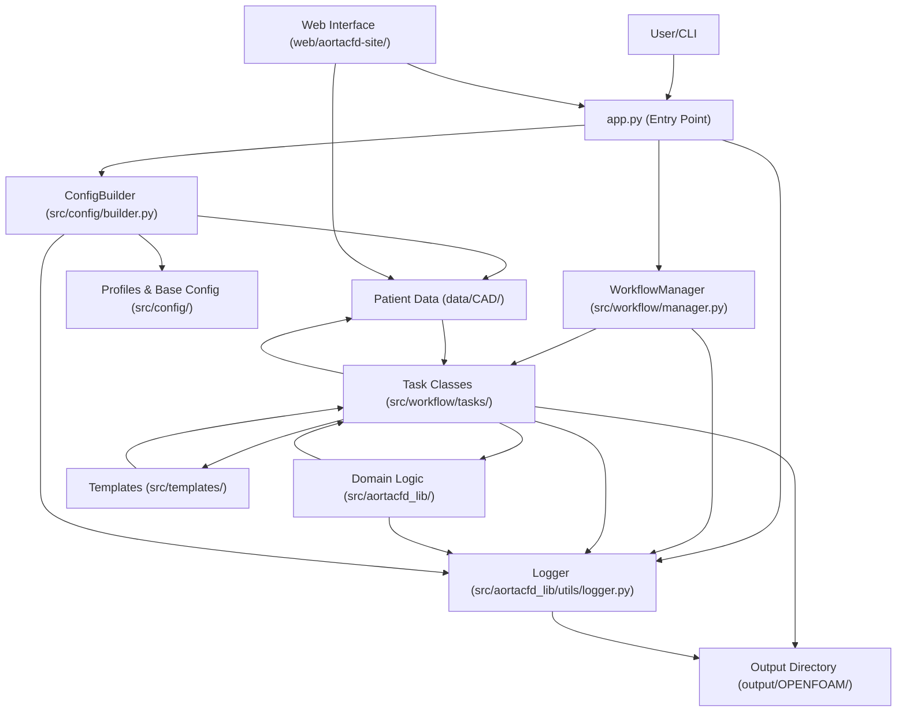

# AortaCFD: Patient-Specific Aortic Blood Flow Simulation

---

## Table of Contents
- [What Problem Does This App Solve?](#what-problem-does-this-app-solve)
- [Core Benefits](#core-benefits)
- [Features](#features)
- [Project Structure](#project-structure)
- [System Requirements](#system-requirements)
- [Pipeline & Architecture Overview](#pipeline--architecture-overview)
- [Installation](#installation)
- [Getting Started](#getting-started)
- [Command Reference](#command-reference)
- [Input Data Structure](#input-data-structure)
- [Web Interface](#web-interface)
- [Known Issues](#known-issues)
- [Updates & Roadmap](#updates--roadmap)
- [Contributing](#contributing)
- [License](#license)

---

## What Problem Does This App Solve?

**AortaCFD** addresses the challenge of performing patient-specific aortic blood flow simulations, which are often complex, time-consuming, and require deep expertise in both medical imaging and computational fluid dynamics (CFD). Existing tools can be difficult for clinicians and researchers to use, especially when setting up advanced boundary conditions like Windkessel models. AortaCFD streamlines the entire workflow—from geometry preparation to simulation and post-processing—making advanced hemodynamic analysis accessible, reproducible, and efficient.

---

## Core Benefits

- **End-to-End Automation:** Automates the full pipeline from geometry to results, reducing manual errors and setup time.
- **User-Friendly:** Simplifies complex CFD workflows for clinicians and researchers.
- **Advanced Boundary Conditions:** Supports three-element Windkessel (3EWK) models for physiologically realistic simulations ([see requirements](#system-requirements)).
- **Extensible & Modular:** Built in Python with a clear, task-based architecture for easy customization.
- **Reproducible Science:** Ensures all steps are logged and repeatable, supporting robust scientific research.

See [Features](#features) for a detailed breakdown.

---

## Features

- Automated case directory and file structure creation
- Mesh generation from STL geometry
- Automated boundary condition setup (including Windkessel models)
- Physical and numerical property file generation
- Parallel and serial solver execution
- Integrated post-processing with ParaView scripts
- Modular, extensible Python codebase

---

## Project Structure

AortaCFD follows a clean, modular architecture with clear separation of concerns:

```
AortaCFD-app/
├── src/                    # Core application source code
│   ├── aortacfd_lib/      # CFD computational library
│   │   ├── mesh_setup.py         # Mesh generation utilities
│   │   ├── boundary_condition_setup.py  # Boundary condition management
│   │   ├── physical_properties_setup.py # Physics configuration
│   │   ├── solver_setup.py       # OpenFOAM solver configuration
│   │   ├── post_processor.py     # ParaView post-processing
│   │   └── utils/               # Common utilities (logger, runner, etc.)
│   ├── workflow/          # Task-based workflow orchestration
│   │   ├── manager.py           # Main workflow coordinator
│   │   ├── base_task.py         # Abstract task base class
│   │   └── tasks/              # Individual workflow tasks
│   ├── config/            # Configuration management
│   │   ├── builder.py           # Dynamic config builder
│   │   ├── base.py             # Base configuration
│   │   └── profiles/           # Simulation profiles
│   └── templates/         # OpenFOAM template files
├── web/                   # Web interface (optional)
│   └── aortacfd-site/     # Flask documentation and upload interface
├── data/                  # Input data and patient cases
│   └── CAD/              # Patient geometry files (STL)
├── output/                # Generated simulation results
│   └── OPENFOAM/         # OpenFOAM case directories
├── tests/                 # Comprehensive test suite
├── app.py                 # Main CLI entry point
└── setup.py              # Package installation configuration
```

### Key Benefits of This Structure:
- **Modular Design**: Each component has a clear, single responsibility
- **Separation of Concerns**: Core logic, web interface, data, and output are clearly separated
- **Easy Development**: Source code organized logically for maintainability
- **Flexible Deployment**: Web interface can be deployed independently
- **Clean Testing**: Test organization mirrors source structure

---

## System Requirements

- **OpenFOAM** (Foundation version 8 or 12 supported)
- **ParaView** (for post-processing, including `pvbatch`)
- **pimpleFOAM_WK** solver for 3-element Windkessel boundary conditions (optional)

### OpenFOAM Version Support

AortaCFD supports multiple OpenFOAM versions with automatic version detection and configuration:

- **OpenFOAM 8** (Foundation) - Default version
- **OpenFOAM 12** (Foundation) - Latest supported version

The system automatically adjusts templates and solver configurations based on the selected version.

[See Installation](#installation) for setup instructions.

### Installing OpenFOAM (Ubuntu Example)

#### OpenFOAM 8 (Default)
```bash
# Add the OpenFOAM repository and install
sudo sh -c "wget -O - https://dl.openfoam.org/gpg.key | apt-key add -"
sudo add-apt-repository http://dl.openfoam.org/ubuntu
sudo apt-get update
sudo apt-get install openfoam8

# Add OpenFOAM to your environment (add this to your ~/.bashrc)
source /opt/openfoam8/etc/bashrc
```

#### OpenFOAM 12 (Latest)
```bash
# Install OpenFOAM 12
sudo apt-get install openfoam12

# Add OpenFOAM 12 to your environment
source /opt/openfoam12/etc/bashrc
```

**Note**: You can have multiple OpenFOAM versions installed. AortaCFD will automatically use the correct environment path based on your version selection.

### Installing ParaView (pvbatch)

You can install ParaView from your package manager or from the [official ParaView website](https://www.paraview.org/download/). Ensure the `pvbatch` executable is available in your PATH.

### Windkessel Model Support

AortaCFD supports 3-element Windkessel (3EWK) boundary conditions for physiologically realistic outlet modeling. The implementation differs between OpenFOAM versions:

#### OpenFOAM 8 Windkessel (Legacy)
For OpenFOAM 8, compile the custom `pimpleFOAM_WK` solver:

```bash
git clone https://github.com/EManchester/OpenFOAM-v8-Windkessel-code.git
cd OpenFOAM-v8-Windkessel-code
wmake
```

#### OpenFOAM 12 Windkessel (Recommended)
For OpenFOAM 12, use the modern `modularWKPressure` boundary condition:

```bash
# Use the provided installation script
./scripts/install_windkessel_of12.sh

# Or install manually:
git clone https://github.com/JieWangnk/OpenFOAM-WK.git
cd OpenFOAM-WK/src/modularWKPressure
wmake
```

The OpenFOAM 12 implementation offers:
- **Modular design**: No custom solver required
- **Better integration**: Works with standard `pimpleFoam`
- **Improved stability**: Enhanced numerical implementation
- **Easier setup**: Parameters defined directly in boundary conditions

---

## Pipeline & Architecture Overview

AortaCFD is built around a modular, task-based pipeline managed by the `WorkflowManager`. Each workflow command triggers a sequence of tasks, ensuring reproducibility and clarity.

**Pipeline vs. Architecture:**
- The **pipeline** describes the sequence of steps (tasks) performed for a simulation.
- The **architecture** shows how the main components of the codebase interact to enable this pipeline.

### Pipeline Overview

# (Remove the mermaid pipeline diagram block here)

### Architecture Flow Map



---

## Installation

### Quick Setup (Recommended)

1. **Clone the repository:**
   ```bash
   git clone https://github.com/yourusername/AortaCFD-app.git
   cd AortaCFD-app
   ```

2. **Run the automated setup script:**
   ```bash
   ./setup_env.sh
   ```
   
   This script will:
   - Install required system packages (`python3-venv`, `python3-full`)
   - Create a virtual environment
   - Install all Python dependencies
   - Provide activation instructions

3. **Activate the environment:**
   ```bash
   source venv/bin/activate
   ```

### Manual Installation

If you prefer manual setup or encounter issues with the automated script:

1. **Install system dependencies:**
   ```bash
   sudo apt update
   sudo apt install python3-venv python3-full
   ```

2. **Create and activate virtual environment:**
   ```bash
   python3 -m venv venv
   source venv/bin/activate
   ```

3. **Install Python dependencies:**
   ```bash
   pip install --upgrade pip
   pip install -r requirements.txt
   ```

### OpenFOAM Installation

4. **Install OpenFOAM** (choose your version):
   
   See [System Requirements](#system-requirements) for detailed OpenFOAM installation instructions.

### Troubleshooting

**If you see "externally-managed-environment" error:**
- This is a safety feature in newer Python installations
- **Always use a virtual environment** (recommended approach above)
- Never use `--break-system-packages` as it can damage your system

**Virtual Environment Best Practices:**
- Always activate the environment before running AortaCFD: `source venv/bin/activate`
- Deactivate when done: `deactivate`
- The `venv/` directory is excluded from git (see `.gitignore`)

---

## Getting Started

1. **Activate the virtual environment:**
   ```bash
   source venv/bin/activate
   ```

2. **Prepare your case data:**
   - Place STL geometry and inlet flow CSVs in a subfolder under `data/CAD/`.
   - Prepare a simulation profile in `src/config/profiles/`.

3. **Run a workflow command:**
   ```bash
   # Using default OpenFOAM version (8)
   python app.py runAll --case PAT1_2024 --profile sim_laminar_fine
   
   # Specify OpenFOAM version explicitly
   python app.py runAll --case PAT1_2024 --profile sim_laminar_fine --openfoam-version 12
   ```

   - Use `--clean` to remove previous results and start fresh
   - Use `--openfoam-version` or `--of-version` to specify OpenFOAM version (8 or 12)

4. **For 3EWK (three-element Windkessel) boundary conditions:**
   
   **OpenFOAM 8:**
   - Compile `pimpleFOAM_WK` solver
   - Use `boundary_conditions_3EWK.json` configuration
   
   **OpenFOAM 12 (Recommended):**
   - Install `modularWKPressure` boundary condition: `./scripts/install_windkessel_of12.sh`
   - Use `boundary_conditions_OF12_windkessel.json` configuration
   - Works with standard `pimpleFoam` solver

5. **Results and logs will be generated in the `output/OPENFOAM/` directory.**

6. **When finished, deactivate the virtual environment:**
   ```bash
   deactivate
   ```

---

## Command Reference

| Command         | Description                                      |
|-----------------|--------------------------------------------------|
| setup:dict      | Generate all dictionary files (pre-mesh)         |
| setup:bc        | Prepare and update boundary condition files       |
| run:mesh        | Run OpenFOAM meshing utilities                   |
| run:solver      | Run the OpenFOAM solver (or pimpleFOAM_WK)       |
| createCase      | Full setup (structure, mesh, properties, BCs)    |
| runAll          | Complete end-to-end workflow                     |

### CLI Arguments

| Argument                    | Description                                      | Required |
|----------------------------|--------------------------------------------------|----------|
| `--case`                   | Name of the case directory in data/CAD/         | Yes      |
| `--profile`                | Name of the simulation profile                  | Yes      |
| `--openfoam-version`       | OpenFOAM version to use (8, 12)                | No       |
| `--of-version`             | Short alias for --openfoam-version             | No       |
| `--clean`                  | Remove previous results and start fresh         | No       |

**Examples:**
```bash
# Basic usage with default OpenFOAM version
python app.py runAll --case PAT1_2024 --profile sim_laminar_fine --clean

# Using OpenFOAM 12
python app.py runAll --case PAT1_2024 --profile sim_laminar_fine --of-version 12

# Help
python app.py --help
```

---

## Input Data Structure

- `data/CAD/<case_name>/`
  - `inlet.stl`, `outlet1.stl`, ..., `wall_aorta.stl`
  - `inletFlowRate.csv`
  - `boundary_conditions.json` (optional)
- `src/config/profiles/<profile_name>.py`
  - Simulation profile (mesh, physics, solver settings)

### Example Case Structure
```
data/CAD/PAT1_2024/
├── inlet.stl              # Inlet geometry
├── outlet1.stl            # Outlet 1 geometry
├── outlet2.stl            # Outlet 2 geometry  
├── outlet3.stl            # Outlet 3 geometry
├── wall_aorta.stl         # Aortic wall geometry
├── inletFlowRate.csv      # Time-varying flow rate data
├── boundary_conditions.json           # Standard boundary conditions
├── boundary_conditions_3EWK.json     # OpenFOAM 8 Windkessel
└── boundary_conditions_OF12_windkessel.json  # OpenFOAM 12 Windkessel
```

### Windkessel Configuration Examples

**OpenFOAM 12 Windkessel (modularWKPressure):**
```json
{
    "boundary_conditions": {
        "outlet1": {
            "type": "3EWINDKESSEL",
            "R": 8000000,     // Peripheral resistance (Pa⋅s/m³)
            "C": 1.5e-10,     // Compliance (m³/Pa)
            "Z": 400000,      // Characteristic impedance (Pa⋅s/m³)
            "order": 2,       // Time discretization order
            "p0": 12000       // Initial pressure (Pa)
        }
    },
    "openfoam_version": "12",
    "windkessel_enabled": true
}
```

---

## Web Interface

AortaCFD includes an optional web interface for documentation, file uploads, and basic simulation management.

### Starting the Web Interface

```bash
cd web/aortacfd-site/
python app.py
```

The web interface will be available at `http://localhost:5000` and provides:

- **Documentation Browser**: Interactive documentation with search
- **File Upload**: Upload STL and CSV files for new cases
- **Physics Calculator**: Calculate Reynolds and Womersley numbers
- **Simulation Runner**: Execute simulations through web interface

### Web Interface Features

- **Case File Management**: Upload geometry files directly to `data/CAD/`
- **Interactive Documentation**: Browse all documentation with search functionality
- **Simulation Execution**: Run simulations with web form interface
- **Physics Tools**: Built-in calculators for hemodynamic parameters

### Production Deployment

For production use, deploy the Flask application using a WSGI server like Gunicorn:

```bash
cd web/aortacfd-site/
pip install gunicorn
gunicorn -w 4 -b 0.0.0.0:8000 app:app
```

---

## Known Issues

- Ensure all required STL and CSV files are present in the case directory.
- For Windkessel models, check that flow split ratios sum to 1.0.
- LES simulations require a fine mesh profile for best results.
- For 3EWK, ensure the custom solver and boundary files are set up as per [OpenFOAM-v8-Windkessel-code](https://github.com/EManchester/OpenFOAM-v8-Windkessel-code).

---

## Updates & Roadmap

- **v1.0:** Initial public release with CLI interface
- **v1.1:** Project restructuring with modular architecture (completed)
  - Separated core application (`src/`) from web interface (`web/`)
  - Clean data organization (`data/` for inputs, `output/` for results)
  - Improved testing infrastructure
- **Planned Features:**
  - Multi-patient batch processing capabilities
  - Enhanced web interface with real-time monitoring
  - Docker containerization for easy deployment
  - Cloud deployment support (AWS, Azure, GCP)
  - Advanced post-processing and visualization tools
  - Integration with medical imaging workflows (DICOM support)

---

## Contributing

Contributions are welcome! Please open issues or pull requests for bug fixes, new features, or documentation improvements.

---

## License

[MIT License](LICENSE)

---

**For more information, see the [Documentation](#) or contact [jie.wang-2@manchester.ac.uk](mailto:jie.wang-2@manchester.ac.uk).**
