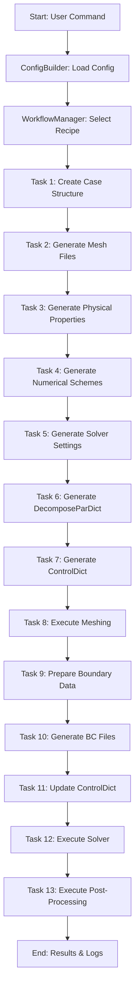

# Pipeline Architecture

AortaCFD is built around a modular, task-based pipeline managed by the `WorkflowManager`. Each workflow command triggers a sequence of tasks, ensuring reproducibility and clarity.

## Pipeline Overview

## Key Pipeline Commands
- `setup:dict`: Generate all non-mesh-dependent dictionary files.
- `setup:bc`: Prepare and update boundary condition files after meshing.
- `run:mesh`: Execute OpenFOAM meshing utilities.
- `run:solver`: Run the OpenFOAM solver (or `pimpleFOAM_WK` for 3EWK cases).
- `createCase`: Full setup (structure, mesh, properties, BCs).
- `runAll`: Complete end-to-end workflow (setup, mesh, BCs, solve, post-process). 