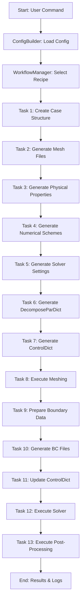

# AortaCFD Pipeline & Architecture Overview

This document provides a comprehensive overview of the AortaCFD application's architecture and workflow pipeline. It is intended to help users and developers understand how the main components interact and how the simulation pipeline is executed.

---

## Architecture Overview

The diagram above illustrates the high-level architecture and flow of the AortaCFD application. The architecture is designed to be modular, extensible, and robust, supporting both advanced users and newcomers in running complex, patient-specific CFD simulations efficiently.

### Architecture Components

| Component           | Description |
|---------------------|-------------|
| **User/CLI**        | User triggers the app via command line, specifying the workflow, case, and simulation profile. |
| **app.py**          | Main entry point; parses arguments, initializes logging, builds configuration, and starts the workflow manager. |
| **ConfigBuilder**   | Merges static and dynamic config from profiles and CAD data to construct the full configuration. |
| **WorkflowManager** | Orchestrates the workflow based on user command, mapping commands to a sequence of modular tasks. |
| **Task Classes**    | Modular steps (setup, execution, etc.); each task is a class for mesh generation, BC setup, solver execution, etc. |
| **Domain Logic**    | Core CFD, BC, mesh, and post-processing logic; scientific and engineering logic for all major operations. |
| **Templates**       | Used for file generation; stores template files for OpenFOAM dictionaries and other configuration files. |
| **CAD Data**        | Patient/case-specific geometry and BCs; contains STL geometry, inlet flow CSVs, and optional BC JSONs. |
| **Logger**          | Centralized logging for all components; ensures traceability and easier debugging. |
| **OPENFOAM Directory** | Output location for simulation results; all generated files, results, and logs are stored here. |

---

## Pipeline Architecture

AortaCFD is built around a modular, task-based pipeline managed by the `WorkflowManager`. Each workflow command triggers a sequence of tasks, ensuring reproducibility and clarity.

### Pipeline Diagram

### Key Pipeline Commands
- `setup:dict`: Generate all non-mesh-dependent dictionary files.
- `setup:bc`: Prepare and update boundary condition files after meshing.
- `run:mesh`: Execute OpenFOAM meshing utilities.
- `run:solver`: Run the OpenFOAM solver (or `pimpleFOAM_WK` for 3EWK cases).
- `createCase`: Full setup (structure, mesh, properties, BCs).
- `runAll`: Complete end-to-end workflow (setup, mesh, BCs, solve, post-process). 