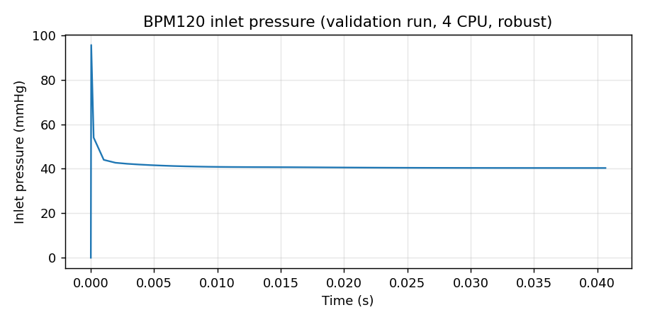

# Session 1: Environment Setup + First Run

**Duration:** 2 hours
**Goal:** Working environment + first aortic CFD result

---

## Hour 1: Setup (60 min)

### 1.1 Install OpenFOAM 12 on WSL2 (20 min)

```bash
# In Windows: open PowerShell as Administrator
wsl --install -d Ubuntu-22.04

# In WSL Ubuntu terminal:
sudo sh -c "wget -O - https://dl.openfoam.org/gpg.key | apt-key add -"
sudo add-apt-repository http://dl.openfoam.org/ubuntu
sudo apt-get update
sudo apt-get install -y openfoam12

# Add to bashrc so OpenFOAM is always available
echo "source /opt/openfoam12/etc/bashrc" >> ~/.bashrc
source ~/.bashrc

# Verify
foamVersion   # Should print "OpenFOAM-12"
```

### 1.2 Install AortaCFD (10 min)

```bash
# Clone the repository
cd ~
git clone https://github.com/JieWangnk/AortaCFD-app.git
cd AortaCFD-app

# Create Python virtual environment
python3 -m venv venv
source venv/bin/activate
pip install --upgrade pip
pip install -r requirements.txt

# Install the Windkessel boundary condition library
./scripts/install_windkessel_of12.sh

# Verify
python run_patient.py --list   # Should show available cases
```

### 1.3 Quick OpenFOAM Review (30 min)

**What you already know:**
- OpenFOAM solves PDEs using finite volume method
- Cases have three directories: `0/`, `constant/`, `system/`
- Mesh is in `constant/polyMesh/`

**What's new in OF12 for cardiovascular CFD:**
- `foamRun` replaces `pimpleFoam` — modular solver selection
- `incompressibleFluid` module for blood flow
- PIMPLE algorithm: merged PISO+SIMPLE for transient flows
- snappyHexMesh with span-based refinement for vessels

**Key concept: Why aortic CFD is different from standard tutorials**
- Pulsatile flow (not steady state) — the cardiac cycle drives everything
- Windkessel outlet BCs (not fixed pressure) — models downstream vasculature
- Backflow during diastole (solver can crash) — needs stabilisation
- Wall shear stress is the clinical output (not just velocity/pressure)
- Reynolds number 500-4500 (transitional, not clearly laminar or turbulent)

**The cardiac cycle in 30 seconds:**
- Systole (~35% of cycle): heart contracts, blood accelerates through aorta, peak velocity ~1-2 m/s
- Diastole (~65% of cycle): heart relaxes, flow decelerates, some backflow at outlets
- Clinical interest: WSS during systole (endothelial damage), oscillatory flow during diastole (plaque)

**Quick start — try the coarse demo config:**
```bash
python run_patient.py BPM120 --config config_tutorial_coarse.json
# Or even quicker:
python run_patient.py BPM120 --quick    # Auto coarse-mesh test mode
```

---

## Hour 2: First Run (60 min)



*What "first run" actually looks like on a small laptop: BPM120,
robust profile, parallel mesh on 4 cores, 25 k cells, CONSTANT plug
inlet at CO=5 L/min, end_time=0.1 s. The pressure spike at t=0 is
the startup transient (pressure-velocity coupling initialising).
Re-running with the production `config.json` (Windkessel outlets,
finer mesh, longer end-time, CSV waveform) is what produces the
publication-quality waveform — but for the first run on day one,
a coarse short run that completes in 10 minutes is the goal.*

### 2.1 Examine the Case Input (10 min)

```bash
cd ~/AortaCFD-app
ls cases_input/BPM120/
```

You'll see:
- `inlet.stl`, `outlet1.stl`, ..., `wall_aorta.stl` — geometry patches
- `config.json` — all simulation parameters in one file
- `flowrate.csv` — pulsatile inlet flow waveform (optional)

Open `config.json` and note:
- `physics.model`: "laminar" — no turbulence model
- `numerics.profile`: "standard" — 2nd order schemes
- `mesh.cells_per_diameter`: mesh resolution control
- `boundary_conditions.outlets.type`: "3EWINDKESSEL"

### 2.2 Run the Pipeline (30 min)

```bash
# Source OpenFOAM
source /opt/openfoam12/etc/bashrc

# Step 1: Generate case + mesh + boundary conditions in one go
python run_patient.py BPM120 --config config_tutorial_coarse.json \
  --run-name my_first_run --steps case,mesh,boundary
# This takes ~5 min. Watch the console output.
# Look at: output/BPM120/my_first_run/openfoam/system/  (generated dictionaries)
# Look at: output/BPM120/my_first_run/openfoam/0/U and 0/p  (boundary conditions)

# Step 2: Start the solver (takes 30-60 min for this coarse config)
python run_patient.py BPM120 --config config_tutorial_coarse.json \
  --update output/BPM120/my_first_run --steps solver
```

> **Troubleshooting:** If the solver crashes with "DICPreconditioner" or "GAMG" errors,
> this is a known issue with some OpenFOAM 12 installations on certain mesh sizes.
> Solutions:
> 1. Try increasing `cells_per_diameter` to 15 (larger mesh avoids GAMG degeneration)
> 2. Use the pre-computed results in `docs/tutorial/precomputed_results/` to continue
> 3. Run the solver on HPC instead of locally (see Session 7)
>
> Steps 1-3 (case, mesh, boundary) should always work — you can inspect the mesh
> and boundary conditions in ParaView even if the solver doesn't run.

### 2.3 Inspect Results in ParaView (20 min)

While the solver runs (or using pre-computed results):

```bash
# Open ParaView (install if needed: sudo apt install paraview)
paraview output/BPM120/run_YYYYMMDD/openfoam/BPM120.foam &
```

In ParaView:
1. Click "Apply" to load the mesh
2. Select "Surface" representation
3. Color by "p" (pressure) — see the aortic pressure distribution
4. Color by "U" (velocity magnitude) — see flow patterns
5. Use "Slice" filter to cut through the aorta

**What to observe:**
- Inlet: where blood enters
- Outlets: where it exits (branches + descending aorta)
- Wall: the aortic surface where WSS acts

---

## Homework

1. Open `cases_input/BPM120/config.json`
2. Change `cells_per_diameter` from the current value to `8` (coarser mesh)
3. Create a new config: `cp config.json config_coarse.json`, edit it
4. Run: `python run_patient.py BPM120 --config config_coarse.json --steps case,mesh`
5. Compare the cell count (look at the console output) with the original
6. Open both meshes in ParaView — what's different?

---

## Command Cheat Sheet

```bash
# List available cases
python run_patient.py --list

# Run complete workflow
python run_patient.py BPM120

# Run specific steps
python run_patient.py BPM120 --steps case,mesh,boundary
python run_patient.py BPM120 --steps solver
python run_patient.py BPM120 --steps postprocess

# Use different config
python run_patient.py BPM120 --config config_coarse.json

# Custom output folder name
python run_patient.py BPM120 --run-name my_test_run

# Quick coarse-mesh test (auto low-resolution for debugging)
python run_patient.py BPM120 --quick

# Override profile from command line
python run_patient.py BPM120 --profile robust

# Update existing run (preserve mesh, redo BCs)
python run_patient.py BPM120 --update output/BPM120/run_xxx --steps boundary,solver

# Show available steps
python run_patient.py --list-steps

# OpenFOAM commands (for reference)
blockMesh          # Create background hex mesh
surfaceFeatures    # Extract surface features from STL
snappyHexMesh      # Create the final mesh
checkMesh          # Check mesh quality
foamRun            # Run the solver (OF12)
decomposePar       # Split mesh for parallel
reconstructPar     # Recombine parallel results
foamToVTK          # Convert to VTK for ParaView
```
