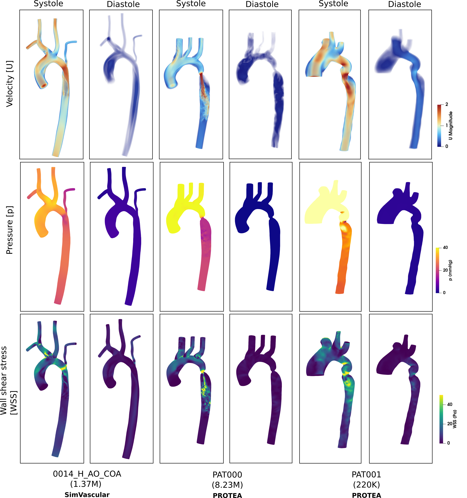

# AortaCFD parametric study — one-page cheat sheet

> Print or pin alongside the [workshop lessons](README.md). Every
> command assumes you're at the AortaCFD-app repo root with the venv
> active and OpenFOAM 12 sourced.



## Install (once)

```bash
git clone https://github.com/JieWangnk/AortaCFD-app.git
cd AortaCFD-app
make install                            # creates ./venv, installs deps
source venv/bin/activate
source /opt/openfoam12/etc/bashrc
./scripts/install_windkessel_of12.sh    # WK boundary-condition library
python run_patient.py --doctor          # verify
```

For synthetic geometries (optional — lessons 2-3):

```bash
git clone https://github.com/JieWangnk/aortacfd-geomgen.git ~/GitHub/aortacfd-geomgen
sudo snap install blender --classic     # or apt install blender
pip install numpy-stl                   # extra dep for the splitter
```

## Block A — generate geometry  (`~/GitHub/aortacfd-geomgen/`)

```bash
python cli.py --list-params                                  # discover params
python cli.py --spec specs/single_baseline.json --output OUT # 1 case
python cli.py --spec specs/sweep_severity.json --output OUT  # 10 cases (linear)
python cli.py --spec specs/sample_sobol_10.json --output OUT # 10 cases (Sobol)
python cli.py --spec specs/grid_2x2.json --output OUT        # 4 cases (grid)

# Override a single parameter without editing the spec
python cli.py --spec specs/sweep_severity.json --output OUT \
    --param diameter=28 --param arch_height=40
```

## Block B — stamp configs onto generated cases  (AortaCFD-app)

```bash
python -m scripts.package_cases /path/to/generated/ \
    --config-template examples/templates/config_workshop_quick.json \
    --output cases_input/my_sweep
```

Three templates ship: `config_workshop_quick.json` (laptop demo, 95 s/case),
`config_sweep_default.json` (production), `config_les_precise.json` (LES).

## Block C — run cases  (AortaCFD-app)

```bash
# One case
python run_patient.py BPM120 --quick

# Local parallel — N cases at once
python run_batch.py --cases A B C --workers 2

# Preview before launching
python run_batch.py --cases A B C --workers 2 --dry-run

# Resume after a partial failure
python run_batch.py --cases A B C --workers 2 --resume

# HPC SLURM job array
python run_batch.py --cases A B C \
    --slurm --partition multicore_small \
    --cluster-conf scripts/hpc/csf3.conf

# HPC with custom SLURM shape (per cluster)
python run_batch.py --cases A B C \
    --slurm --slurm-template scripts/hpc/my_cluster.template.sh \
    --cluster-conf scripts/hpc/my_cluster.conf
```

## Block D — aggregate cohort  (AortaCFD-app)

```bash
python -m scripts.compare_cohort output/                  # all cases
python -m scripts.compare_cohort output/ --parquet        # + parquet
python docs/workshop/plot_severity_sweep.py               # severity → QoI plot
```

## Visualise  (ParaView)

```bash
/usr/bin/paraview                                         # NOT the OF12-bundled one
/usr/bin/paraview cases_input/sev_001/wall_aorta.stl      # compare geometries
/usr/bin/paraview output/sev_005/run_*/openfoam/sev_005.foam   # solver output
```

## Hybrid: local prep + HPC solve + local post

```bash
# 1. local prep
python run_batch.py --cases A B C --steps case,mesh,boundary --run-name hpc_batch --workers 4

# 2. upload, solve, download
bash scripts/hpc/sync_prepared_cases.sh up scripts/hpc/csf3.conf output/A/hpc_batch ...
python run_batch.py --cases A B C --slurm --steps solver --run-name hpc_batch \
    --cluster-conf scripts/hpc/csf3.conf
# (submit batch_submit.sh on cluster, wait)
bash scripts/hpc/sync_prepared_cases.sh down scripts/hpc/csf3.conf output/A/hpc_batch ...

# 3. local post
python run_batch.py --cases A B C --steps hemodynamics,post --run-name hpc_batch --workers 4
python -m scripts.compare_cohort output/
```

## One-shot demo (lessons 2-5 in a single take)

```bash
bash docs/workshop/demo.sh
# expects $HOME/GitHub/aortacfd-geomgen on disk + Blender on PATH
# ~10 min wall-clock, produces 10 cases + cohort CSV + sensitivity plot
```

## Troubleshooting

| Symptom | Fix |
|---|---|
| `foamRun: command not found` (HPC) | Pass `--cluster-conf` so the SLURM script loads the OpenFOAM module |
| `libQt6DBus undefined symbol` (ParaView) | Use `/usr/bin/paraview`, not the OF12-bundled one |
| Solver FPE on synthetic case | Outlets default to zeroGradient + fixedValue anchor — Windkessel needs TIMEVARYING with a ramp |
| `Unknown parameter 'diametr'` | Validator caught a typo — try `python cli.py --list-params` |
| `compare_cohort` import error | Old AortaCFD-app version; pull / pip-install latest |

## Links

- Workshop lessons: [`docs/workshop/`](README.md) (six lessons + notebook + demo script)
- Parameter reference: [`aortacfd-geomgen/PARAMETERS.md`](https://github.com/JieWangnk/aortacfd-geomgen/blob/main/PARAMETERS.md)
- Customise a sweep: [`aortacfd-geomgen` README — "How to customise"](https://github.com/JieWangnk/aortacfd-geomgen#how-to-customise-your-sweep)
- HPC tokens: [`scripts/hpc/README.md`](../../scripts/hpc/README.md)
- Cite: [Zenodo DOI 10.5281/zenodo.20184620](https://doi.org/10.5281/zenodo.20184620)
