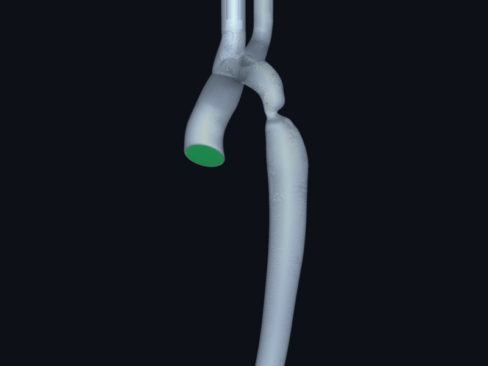

# AortaCFD parametric study workshop

End-to-end walkthrough of running AortaCFD at scale: from a single
patient case to a hundred synthetic Sobol-sampled cases on HPC.

*A typical output of the AortaCFD pipeline: split STL geometry, the
generated computational mesh, peak-systolic velocity, and wall shear
stress — all from one JSON config.*

The workshop is structured as **six independent lessons** over four
composable blocks:

| Block | What it does | Lives in |
|---|---|---|
| **A — Geometry generator** | Parametric Blender aorta. Single / sweep / Sobol-sample modes. Outputs split STL patches. | `~/GitHub/aortacfd-geomgen/` ([repo](https://github.com/JieWangnk/aortacfd-geomgen)) |
| **B — Case packager** | Stamps a config.json template onto a folder of generated cases. | `scripts/package_cases.py` |
| **C — Runners** | `run_patient.py` (one case), `run_batch.py --workers N` (local parallel), `run_batch.py --slurm` (HPC). | `run_patient.py`, `run_batch.py`, `scripts/hpc/` |
| **D — Cohort aggregator** | Joins per-case QoIs + sweep params into one CSV. | `scripts/compare_cohort.py` |

Each block stands on its own. Hand-off between blocks is by filesystem
(folders of files), not by Python imports. Pick the level of automation
you want: run each block by hand, glue them together with shell
scripts, or wire them into Snakemake/Nextflow later.

## Lessons

| # | Lesson | Block(s) | Time |
|---|---|---|---|
| 1 | [Run one case](lesson_01_one_case.md) | C | ~10 min |
| 2 | [Generate one synthetic aorta](lesson_02_blender_one_stl.md) | A | ~5 min |
| 3 | [Sweep + package](lesson_03_blender_sweep_plus_packaging.md) | A + B | ~10 min |
| 4 | [Run a local batch](lesson_04_local_batch.md) | C | ~30 min |
| 5 | [Aggregate and analyse](lesson_05_aggregate.md) | D | ~15 min |
| 6 | [Scale to HPC](lesson_06_hpc.md) | C (SLURM) | ~30 min plus cluster wall-time |

Lessons are independent — if you only care about generating geometries,
stop after lesson 2. If you only want batches of clinical cases, you
can skip lesson 2 entirely and use your own STL folders as input to
lesson 3.

## What the pipeline produces

*Velocity, pressure, and wall shear stress fields across a multi-case
cohort. Each row is one patient or synthetic geometry; each column
is one quantity of interest. This is the kind of figure you can
produce after lesson 5 (cohort aggregation).*

## Cleaning up afterwards

When you're done, `make clean-all CONFIRM=yes` resets the app to a
fresh-clone-equivalent state (removes `output/`, build artefacts, all
Python caches). It preserves `cases_input/`, the venv, and the repo
source. Run `make clean-all` without `CONFIRM=yes` first to dry-run
and see what would be removed plus the total disk freed.

## Prerequisites

- AortaCFD-app installed and working (`python run_patient.py --doctor` passes)
- OpenFOAM 12 Foundation sourced
- The Windkessel boundary-condition library installed (`./scripts/install_windkessel_of12.sh`)
- Optional: Blender 3.x+ on PATH (for lessons 2–3); without it, you can use the
  precomputed STLs shipped under `lesson_03_blender_sweep_plus_packaging.md`.
- For lesson 6 only: SSH access to a SLURM cluster with OpenFOAM 12 module

## What you'll know at the end

- Run a single case and read its QoI summary
- Generate one or many synthetic aortas with a known parameter spec
- Stamp a default config onto a batch of cases
- Run a batch in parallel on a laptop / workstation
- Aggregate cohort results into a tidy CSV
- Submit the same batch to SLURM and retrieve results
- Compose the four blocks into your own automation
