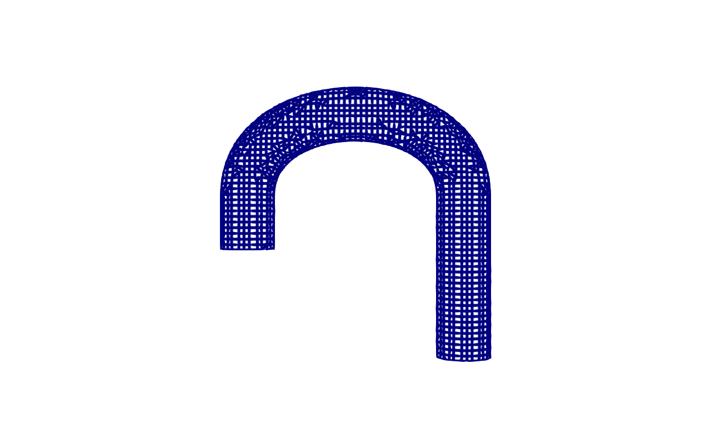
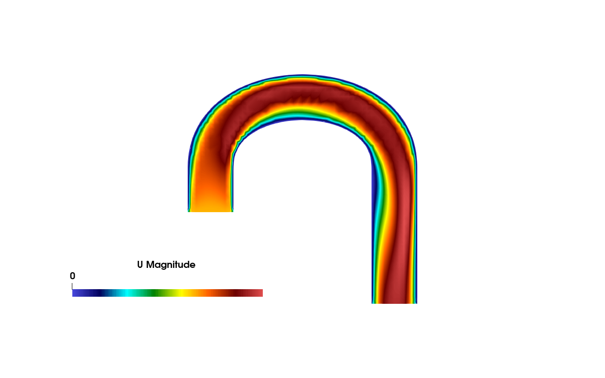

# Lesson 1 — Run one case

Goal: confirm AortaCFD-app installs cleanly and run a single canonical
patient case end-to-end. ~10 minutes on a laptop with `--quick`.



*BPM120 is a published pediatric aortic coarctation case (Wang et al.).
Three supra-aortic branches, severe isthmus narrowing, ~1.9M-cell
production mesh. This is what we'll be running below.*

> **ParaView heads-up.** OpenFOAM 12 bundles its own `paraview-5.11` libraries
> on `LD_LIBRARY_PATH` after you source `/opt/openfoam12/etc/bashrc`.
> If you launch a separate standalone ParaView (e.g. an unpacked
> `~/ParaView-6.0.1/bin/paraview`) from the same shell you'll typically
> hit an `undefined symbol ... libQt6DBus.so.6` error because the system's
> Qt6 gets loaded before ParaView's bundled Qt6.
>
> Workshop convention: use the **system ParaView** (`/usr/bin/paraview`,
> installed via `apt`) for all visualisation in the workshop. It avoids
> the Qt6 conflict and the OF12-bundled paraview-5.11 is too old for some
> of the postprocessing filters we use.

## Steps

```bash
source venv/bin/activate
source /opt/openfoam12/etc/bashrc

# Sanity-check the install
python run_patient.py --doctor
python run_patient.py --list   # should show BPM120, 0014_H_AO_COA, VOL04

# Run BPM120 in fast-test mode (3 cycles compressed, robust numerics)
python run_patient.py BPM120 --quick
```

While it runs, watch the workflow steps print in order: `case → mesh →
boundary → solver → reconstruct → hemodynamics → post`.

## What you should see at the end

```
output/BPM120/run_<timestamp>/
  openfoam/                    # OpenFOAM case directory
  logs/                        # decomposePar, snappy, solver logs
  reports/results/
    qoi_summary.json           # ← the key output
    qoi_summary.csv
```

Read the QoIs:

```bash
python -c "import json; \
  print(json.dumps(json.load(open('output/BPM120/run_*/reports/results/qoi_summary.json'))['qoi'], indent=2))"
```

The pressure drop, peak systolic WSS, and OSI numbers all come from
`src/aortacfd_lib/hemodynamics_postprocessor.py`. Their physical meaning
is defined alongside each value in the JSON.



*Peak-systolic velocity through BPM120. The high-speed jet through the
coarctation is the geometry-dominated feature that drives the pressure
drop and elevated WSS. This is what `paraview output/BPM120/run_*/openfoam/BPM120.foam`
will show you when the run finishes.*

## What's happening

```
cases_input/BPM120/         →   workflow tasks (in order)        →   output/BPM120/run_<timestamp>/
  config.json                    1. case  : render OF dictionaries     openfoam/  (mesh, fields)
  inlet.stl                      2. mesh  : snappyHexMesh              reports/   (QoI, plots)
  outlet1..4.stl                 3. boundary: write BCs from config    logs/
  wall_aorta.stl                 4. solver: foamRun -solver incompressibleFluid
  BPM120.csv (inflow)            5. reconstruct
                                 6. hemodynamics: TAWSS / OSI / WSS
                                 7. post : flatten QoIs into JSON+CSV
```

You can run a subset of steps with `--steps`:

```bash
python run_patient.py BPM120 --steps case,mesh,boundary --quick
```

Useful for debugging: stop after mesh, eyeball the mesh in ParaView,
then continue with `--steps solver,reconstruct,hemodynamics,post`.

## Next

In lesson 2 you'll generate a synthetic aorta (instead of using a
canonical patient case) and produce the same case-layout that
`run_patient.py` consumes.
