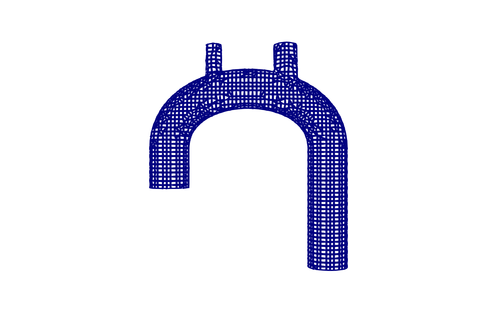
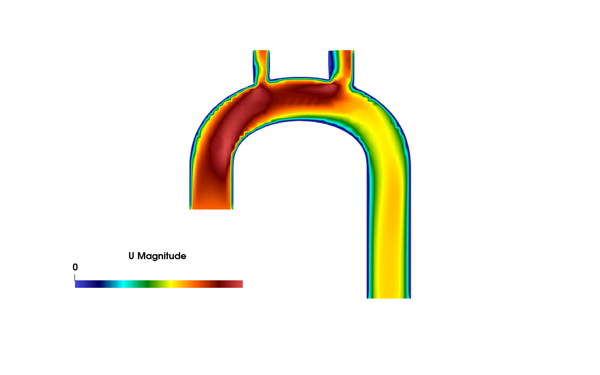
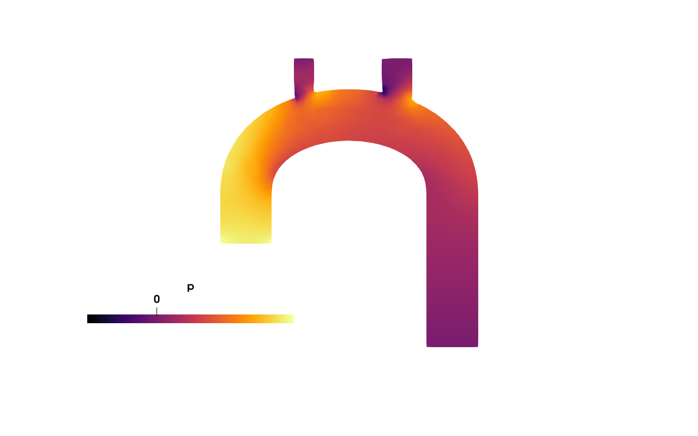

# Lesson 2 — Generate one synthetic aorta

Goal: produce a single AortaCFD-ready case folder using the Blender
geometry generator (Block A). ~5 minutes, mostly Blender start-up time.



*Block A produces a parametric aortic-arch geometry with three
supra-aortic branches and (optionally) a smooth coarctation. Above:
the surface mesh of one such generated case rendered in ParaView.*

## Prereq

- Blender 3.x+ on PATH (`blender --version`). On Ubuntu: `sudo snap install blender --classic`.
- Python deps for the splitter: `pip install numpy numpy-stl scipy`.

If you don't have Blender, skip to **"No Blender?"** at the bottom.

## Steps

```bash
cd ~/GitHub/aortacfd-geomgen   # git clone https://github.com/JieWangnk/aortacfd-geomgen.git
python cli.py --spec specs/single_baseline.json --output /tmp/gen_single
```

This runs three things behind the scenes:

1. `blender -b -P blender_aorta_like_generator.py -- ...` — produces a
   monolithic STL of an aortic arch with three supra-aortic branches
   and a moderate coarctation
2. `split_patches.py` — flood-fills the cap faces and writes
   `inlet.stl`, `outlet1..4.stl`, `wall_aorta.stl`
3. Writes `geometry.meta.json` with the parameters, seed, and patch
   checksums for provenance

## What you should see

```
/tmp/gen_single/
  baseline/
    inlet.stl
    outlet1.stl     # descending aorta
    outlet2.stl     # branch 1 (brachiocephalic)
    outlet3.stl     # branch 2 (left common carotid)
    outlet4.stl     # branch 3 (left subclavian)
    wall_aorta.stl
    baseline.stl    # monolithic — kept for visualisation, NOT used by AortaCFD-app
    baseline.json   # Blender's geometry metadata
    geometry.meta.json   # provenance (the file Block B reads next)
  sweep_manifest.csv
  single_baseline.json   # copy of the spec, for reproducibility
```

Open `baseline.stl` in ParaView, Meshlab, or Blender (GUI) to look at
the geometry.




*Once the generated geometry is run through Blocks B-C (lessons 3-4),
you get velocity and pressure fields like these. Geometry parameters
(diameter, arch height, coarctation severity) propagate directly to
QoI variation across the cohort.*

## Vary the geometry

Three ways to vary parameters:

### (a) Edit a copy of the spec

```bash
cp specs/single_baseline.json specs/my_aorta.json
$EDITOR specs/my_aorta.json
# change diameter, arch_height, coarctation_area_reduction, etc.
python cli.py --spec specs/my_aorta.json --output /tmp/gen_custom
```

All Blender parameters are documented in
[`README.md`](../../../aortacfd-geomgen/README.md) and in the source at
[`blender_aorta_like_generator.py`](../../../aortacfd-geomgen/blender_aorta_like_generator.py).

### (b) Sweep one parameter (linear)

See lesson 3.

### (c) Sample from a parameter space (Sobol)

See lesson 3.

## No Blender?

The workshop ships 6 precomputed sample geometries in
`docs/workshop/precomputed_geom/` (one per Sobol-sample case). You
can skip Blender entirely and start lesson 3 from those.

## Next

Lesson 3 chains Block A (generation) with Block B (case packaging) so
the generated geometries are ready for `run_patient.py`.
