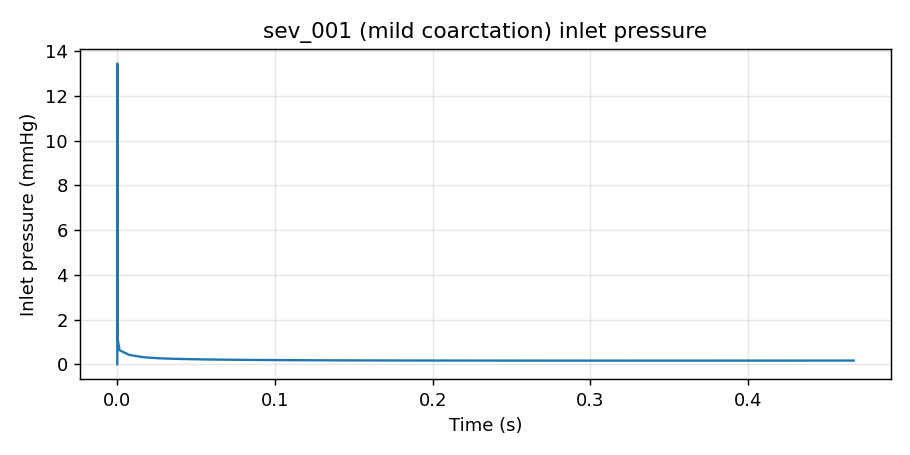

# Lesson 4 — Local batch

Goal: run the 10 cases from lesson 3 in parallel on a laptop /
workstation. Time budget: 30 min on 8-core laptop with `--quick`, hours
on a workstation with full config.

Each of your 10 cases produces a full unsteady velocity / pressure /
WSS field in OpenFOAM time-step format under `output/sev_NNN/run_*/`.
Lesson 5 reduces these to scalar QoIs per case.



*One of the 10 cases captured from the actual local-batch validation
run (4 CPU per case, sequential, 10-min wall budget each). sev_001 is
the mildest coarctation in the sweep; it reached t≈0.47 s of the
0.2-s × 1-cycle target before the budget was hit. Pressure trace is
the area-averaged inlet pressure recorded by the `inletPressure`
function object every solver step.*

## Steps

```bash
cd ~/GitHub/AortaCFD-app

# Preview before launching (sanity-check, no execution)
python run_batch.py --cases sev_001 sev_002 sev_003 sev_004 sev_005 \
    sev_006 sev_007 sev_008 sev_009 sev_010 \
    --workers 2 --dry-run

# When happy, drop --dry-run
python run_batch.py --cases sev_001 sev_002 sev_003 sev_004 sev_005 \
    sev_006 sev_007 sev_008 sev_009 sev_010 \
    --workers 2 --quick
```

`--workers 2` means two cases run concurrently. Each case internally
uses the subdomains specified by its `run_settings.subdomains` config
field (default 4 for the workshop-quick template). On an 8-core laptop:
2 cases × 4 cores = 8 cores used.

Rule of thumb: `workers × subdomains_per_case ≤ physical_cores`.

## What you should see

```
output/sev_001/run_<timestamp>/
  reports/results/qoi_summary.json
  manifest.json     # status, wall_seconds, git SHA
output/sev_002/ ...
output/sev_010/
output/cohort_comparison.csv     # written automatically after the batch
output/batch_summary.json        # success/failure per case
```

The cohort CSV is written by Block D (`scripts/compare_cohort.py`)
automatically at the end of a successful batch.

## When a case fails

`run_batch.py` does not stop on failure — failed cases get logged and
the batch continues. After the batch:

```bash
# Show only failures
python -c "import json; \
  rs=json.load(open('output/batch_summary.json'))['results']; \
  print('\n'.join(r['output_id'] for r in rs if not r['success']))"

# Rerun only the failures (--resume skips successes)
python run_batch.py --cases sev_001 ... --resume --quick
```

## Larger sweeps (50–100 cases)

On a workstation (16+ cores) the same command scales:

```bash
python run_batch.py --cases-dir cases_input/sobol_demo \
    --workers 4 --quick
```

100 quick cases at ~30 min/case with 4-way parallelism = ~12 hours.
Mostly unattended — leave it running overnight. For multi-day batches,
move to HPC (lesson 6).

## Tips

- **Start with `--dry-run`** before any large batch. It prints exactly
  what would run and where, without launching Blender, OpenFOAM, or
  anything else expensive.
- **Watch one case live**: `tail -f output/sev_001/batch_sev_001.log`
- **Throttle workers** if your laptop is thrashing: each case writes a
  lot to disk (mesh, fields, postProcessing). `workers=2` is usually
  the sweet spot on consumer SSDs.
- **`--resume`** is your friend for partial failures or interrupted
  batches. It checks `output/<case>/<run>/manifest.json` (or falls back
  to `qoi_summary.json` existence) to decide what's already done.

## Next

Lesson 5 reads the `cohort_comparison.csv` and produces a
parameter-vs-QoI sensitivity table.
