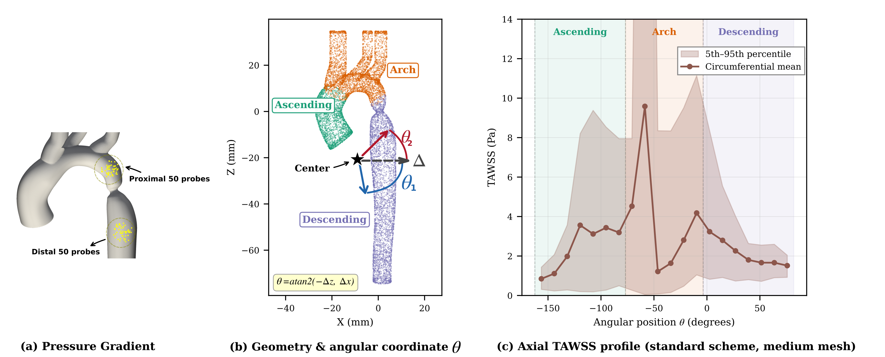
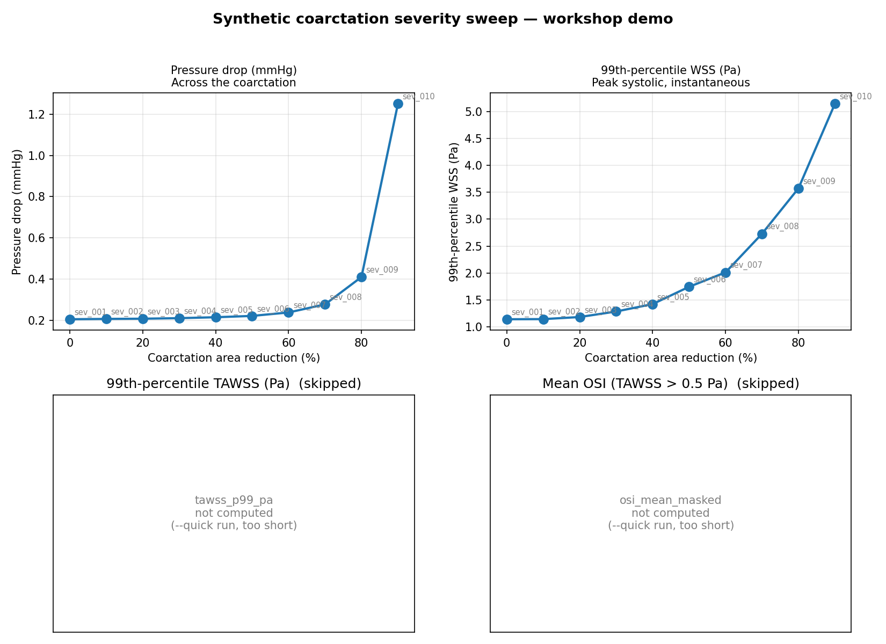

# Lesson 5 — Aggregate and analyse

Goal: read the cohort CSV produced by Block D, plot parameter →
QoI sensitivity, and compute first-order Sobol indices. ~15 min.



*The QoIs Block D exposes — pressure drop, percentile WSS / TAWSS,
masked OSI, residence time — are computed per case by the AortaCFD
hemodynamics post-processor. Block D's job is to turn one row per
case into a tidy table.*

## Aggregate (if not done automatically)

`run_batch.py` calls `compare_cohort` at the end of every successful
batch. If you need to rebuild the CSV — e.g. after re-running with
`--resume`, or if you only want a subset of cases — call it directly:

```bash
# All cases under output/
python -m scripts.compare_cohort output/

# Specific subset
python -m scripts.compare_cohort output/ --cases sev_001 sev_002 sev_003

# Also write parquet (for downstream pandas / DuckDB workflows)
python -m scripts.compare_cohort output/ --parquet
```

## What's in cohort_comparison.csv

One row per case, with three groups of columns:

1. **Identification**: `case_id`, `run_id`, `status`, `wall_seconds`, `git_sha`, `sample_index`, `geometry_source`
2. **Sweep parameters** (from `case.meta.json`): `param_diameter`, `param_coarctation_area_reduction`, ...
3. **Quantities of interest** (from `qoi_summary.json`): `pressure_drop_mean_mmhg`, `wss_p99_pa`, `tawss_p99_pa`, `osi_mean_masked`, `dp_outlet1_mmhg`, ...

The join is by directory structure: `output/<case_id>/.../qoi_summary.json`
is matched with `cases_input/<case_id>/case.meta.json`.

## Notebook for sensitivity analysis

See [`notebook_qoi_sensitivity.ipynb`](notebook_qoi_sensitivity.ipynb).
The notebook walks through:

1. Loading `cohort_comparison.csv` into pandas
2. Filtering to successful cases
3. Scatter / pairplot: each parameter vs each QoI
4. First-order Sobol indices via `SALib.analyze.sobol`
5. Identifying the most influential parameters

Quick start:

```bash
pip install salib seaborn matplotlib jupyterlab
jupyter lab docs/workshop/notebook_qoi_sensitivity.ipynb
```

If you don't want to use Jupyter, the notebook's code blocks copy
straight into a Python script.

## What the analysis tells you

For the severity sweep (lesson 3 → 4):

- **`pressure_drop_mean_mmhg` vs `param_coarctation_area_reduction`**:
  should be monotonic — pressure drop rises with severity.
- **`wss_p99_pa` vs severity**: should also rise (jet accelerates).
- **`osi_mean_masked` vs severity**: less obvious — depends on
  recirculation patterns downstream of the stenosis.

For a Sobol sample (e.g. `specs/sample_sobol_50.json`):

- First-order indices `S_i` tell you what fraction of the QoI variance
  is explained by each parameter alone.
- Total-order indices `S_T_i` include interaction effects.

For a clean coarctation sweep we expect `S_coarctation_area_reduction`
≈ 0.6–0.9 for pressure drop, with much smaller contributions from arch
geometry parameters.



*The finale figure of the workshop demo. Pressure drop and 99th-
percentile wall shear stress both rise monotonically with coarctation
severity (10-case sweep). Mesh-level convergence checks and Sobol
indices live in the notebook.*

## Going further: ML surrogate training

The `cohort_comparison.csv` is the `(X, y)` pair for a surrogate. The
`param_*` columns are X; the QoI columns are y. You can train a small
MLP or polynomial-chaos expansion directly on this CSV. For
mesh-level training data (velocity / pressure fields), see the future
Block E (`scripts/export_for_ml.py`) hook in the roadmap.

## Next

Lesson 6 moves the same workflow to HPC for 100+ case runs.
